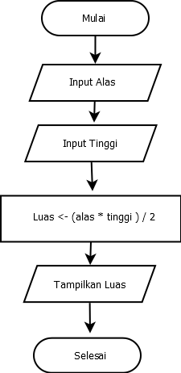

# MSIB SKILVUL #TECH4IMPACT BATCH 4

## Data diri  :rocket:
#### Nama : Daffa
#### EMAIL : 111202012648@mhs.dinus.ac.id
#### Univ. Asal : Universitas Dian Nuswantoro
#### Track : Frontend Web Developer
#### Group : FEBE 13 /FE 2
---

## Resume week 1
### Unix Command Line

 - SHELL merupakan sebuah program yang mana memungkinkan user untuk memerintah atau berkomunikasi dengan sistem
 - CLI atau kepanjangannya *Command Line Interface* merupakan jenis SHELL yang berupa teks
 - Untuk kita bisa melakukan menuliskan command, kita perlu platform. Terminal emulator merupakan salah satu aplikasi untuk mengakses CLI 
 - File System adalah suatu metode untuk memberikan nama pada sebuah folder dan meletakkannya pada media penyimpanan 
 - Pada file sistem tersebut ada strukturnya yang membuat penyimpanan lebih teratur, hal tersebut dinamakan file system structure
 - Pada sistem operasi windows & unix  -like media penyimpannnya hampir mirip, yaitu seperti bentuk tree 
****
 - Terdapat command atau perintah perintah yang bisa kita gunakan untuk melakukan aksi atau manipulasi, antara lain :
	 - **PWD (*Print Working Directory*)** Command pwd merupakan sebuiah perintah untuk mengetahui dimana path kita berada, ex.

	  	

	 -  **ls (*Lists*)** Merupakan sebuah command untuk melihat apa saja sih file yang ada pada folder yang sedang kita buka, ex.

	 	
	 - **cd (*change directory*)** Merupakan command yang sangat sering digunakan karena digunakan untukberpindah folder / direktori, ex.

		
		
	- **touch** Command touch merupakan perintah untuk membuat sebuah file baru pada direktori, ex.
	

	- **MKDIR (*Make Directory*)** Merupakan sebuah command untuk membuat suatu direktori baru
	- Ada beberapa command untuk membaca sebuah file yang ada pada suatu direktori yaitu **CAT** dimana **CAT** merupakan command untuk melihat semua isi file. Ada juga **HEAD** untuk melihat isi file yang teratas dan **TAIL** melihat yang berada pada line terbawah.

	- Kita juga bisa mengedit isi file dengan command sesuai editor yang akan kita gunakan, ex

		 
		
	- **cp (*Copy*)** Merupakan sebuah command yang kita gunakan untuk mengcopy atau menyalin file atau directory
	- **mv (*Move*)** Kita gunakan command ini untuk memindahkan file atau directory. Selain itu kita juga bisa rename dengan command ini
	- **rm (*Remove*)** Yang terakhir kita bisa memanipulasi dengan menghapus file atau direktori dengan command rm. untuk menghapus file  `rm -R` sedangkan untuk menghapus direktori menggunakan command `rm -d`
---
### Git dan Github
 - Saat bekerja bersama dalam suatu programmer membutuhkan suatu tools yang membantunya agar mudah untuk berkolaborasi dengan sesama programmer
 - Git merupakan salah satu tools yang dibuat bagi programmer untuk memudahkan pekerjaan sebagai Version control System
 - Version control system memiliki tugas untuk mencatat setiap change atau perubahan yang dilakukan (termasuk manipulasi perubahan file dan code yang kita buat) pada ruang lingklup kerja individu maupun dengan tim
 - Untuk penyedia layanan penyimpanan version control system git biasanya menggunakan **github**, **gitlab**, atau **bitbucket**.
 - Sebelum kita mengetahui bagaimana cara menggunakan git dan github kita perllu melakukan instalasi dengan beberapa step :
	 -  Mendownload dan install [git](https://git-scm.com/downloads). 
	 - Melakukan configurasi dengan command 
		 `git config global user.name "daffaRadh"` 
		 `git config global user.email"daffasven@gmail.com"`
	- Nantinya kita dapat mengecek hasil config kita dengan command `git config --list`
		 
 - Setelah kita sudah menginstall  git di desktop kita, selanjutnya kita perlu memahami bagaimana cara agar kita bisa membuat repository (direktori penyimpanan file proyek) hingga push ke vendor git hub. command dan stepnya adalah :
	- `git init` command tersebut digunakan untuk menginisialisasi sebuah repository di file lokal
	- `git add .` command yang digunakan untuk menambahkan  file baru pada file lokal tersebut
	- `git commit -m "first commit"`Digunakan untuk menyimpan perubahan yang ada namun masi pada local repository, pada remote repository belum update
	- `git remote ...` Merupakan command untuk mengkoneksikan atau menghubungkan repository local ke repository server lain (in this case menggunakan server git hub)
	- `git branch -b [nama branch]` Merupakan command untuk mengganti nama branch tertentu
	- `git push -u origin master/main` Merupakan langkah terakhir untuk kita dapat push atau mengirimkan perubahan pada repository lokal kita ke remote repository
 - hal hal diatas merupakan langkah langkah dan command yang dapat kita gunakan untuk kita dapat menambahkan file projek kita ke repository yang ada pada github. Selain itu ada command command yang dapat membantu kita dalam tracking atau mungkin memcahkan suatu masalah dalam proses mengirimkan ke git hub yaitu antara lain :
	- `git status` merupakan command untuk mengecek dan melihat apakah terjadi perubahan pada git kita
	- `git checkout` command yang digunakan untuk kita pada saat berpindah ke branch lain
	- `git merge` command yang diogunakan untuk menggabungkan (*merged*) branch cabang ke branch master / main 
	---
	### HTML
	

 - HTML atau singkatan dari *Hypertext Markup Languange* merupakan bahasa scripting yang digunakan untuk membuat website
 - Html bertindak sebagai dasar atau kerangka dalam pembuatan website sebelum nantinya ada css dan javascript
 - Pada saat kita coding html bisa dari mana saja toolsnya namun code editor yang sering digunakan adalahg Visual Studio Code
 - Selain lebih menarik, visual studio code juga memiliki penunjang berupa extension untuk membantu pekerjaan web developer agar lebih mudah
 - Selain itu fitur yang sering digunakan di visual studio code antara lain, run dan debug, built in git, dan extension seperti live server (digunakan untuk melihat langsung website yang kita buat melalui visual studio code ke browser), prettier,  close tag, dan lain sebagainya.
 - Pada html sendiri memiliki structure yang harus di ikuti
 - 
 - Pada structure terdapat `html`,`head`, dan `body`
 - Pada html juga terdapat struktur untuk elemen yaitu **opening tag** `
` lalu ada **content** `Hello World` dan juga **closing tag** `
`
 -  Pada html juga terdapat single tag atau singular tag seperti 
	 - ` `
	 - `
`
	 - ``  
 - Ada juga yang double tag atau paired tag seperti `
__
`,`<h1>__</h1>`
 - Html elemen juga memiliki attribute seperti id,class, atau name. Nantiny akan memudahkan kita dalam mengambil atau memilih elemen secara spesifik dengan attribut yang berbeda
 - 
 - Pada pembuatan tabel di html terdapat beberapa elemen tambahan antara lain :
	- `<tr>___</tr>` yaitu singkatan dari *Table Row* yang digunakan untuk menambah baris pada tabel
	- `<td>__</td>` digunakan untuk menambahkan data atau cell pada suatu baris tadi
	- `<th>___</th>` kita boleh memberi th atau *table header* yang mana nantinya semua data yang ada di elemen `<th>` akan ditulis bold dan center
 - Kita juga bisa membuat semantic html yang mana artinya menggunakan elemen yang memili maksud yang jelas dan sesuai dengan kebutuhan seperti `<header>___</header>`, `<nav>__</nav>`, `<footer>___</footer>`, `<section>___</section>`, `<aside>__</aside>` dll
 - Kita bisa deploy atau fase dimana kita push website kita ke server yang dapat di akses orang banyak nantinya secara realtime
 - kita bisa menggunakan platform netlify atau github pages
 - 
 - Projek yang saya kirim ke netlify [kalkulator](https://calculatormwah.netlify.app/). 
---
### CSS

 - CSS atau *Casading Style Sheet* digunakan untuk mendesain website kita yang sudah jelas kerangka awalnya dengan html tadi. Bisa mengubah warna, ukuran font, jenis font, warna font, dan styling lainnya.
 - CSS dapat di sisipkan dengan 3 cara yaitu :
	 - **inline**
		
	 - **internal**
	 	
	 - **Eksternal**
	 	
 - CSS sendiri juga memilik sintaks yaitu
`  .elementHTML{  
     property : value } `
 - tanda "." menandakan selektor yang merujuk pada tag html yang memiliki properti kelas, apabila id kita bisa menggunakan tanda "#"
 - Untuk poperti css yang populer seperti ; background-color,font-size, background-color, display, position.
 - Selain itu kita bisa memberikan komen ke css berupa `/* */`
 - Selain itu di css kita dapat mengubah website kita agar responsive dengan `media-query`
 - Di css ada properti flexbox yang mana dapat membantu kita membuat element website kita menyesuaikan layout secara otomatis
 - Flexbox nantinya akan diberi di containernya  yang memiliki beberapa child
 -  Ada bebrapa properti dari flexbox yang membantu, antara lain :
	- *flex-direction* untuk mengatur letak childnya, ada 4 direction yaitu; row reverse, row (default), coloumn, coloumn-reverse
	- *flex-wrap* Dalam satu line kita bisa membatasi jumlah children nantinya child yang dibatasi akan ke posisi line baru. Ada 3 tipe wrap; no-wrap (default), wrap, wrap-revrese
	- *flex-flow* digunakan sebagai shortcut untuk mengatur flex-direction dan flex-wrap secara bersamaan
 -   Order digunakan untuk megubah urutran item yang ingin diatur posisinya urutannya
 -   Justify - content digunakan untuk mengatur letak item secara horizontal
 -   Align - content digunakan untuk mengatur tata letak antar item secara vertical
 -   Flex-grow digunakan mengatur size child di container flexbox
 -   Flex-shrink digunakan untuk memperkecil size dari child bisa 0 besar, semakin diatas 0 akan semakin kecil
 -   flex-basis digunakan untuk mengatur width pada tiap child dengan sama
---
### Algortima dan Pseudocode

 - Algoritma sendiri merupakan suatu proses dimana kita membuat deksripsi langkah langkah menyelesaikan suatu maslah dengan cara yang efektif
 - Dengan algoritma nantinya masalah yang diselesaikan bisa teratasi dengan efektif dan terstruktur
 - kita juga perlu memperhatika kualitas sebuah algoritma itu sendiri yaitu :
	 -   Input & output harus jelas/ didefinisikan terlebih dahulu dgn tepat
	-   Setiap step harus benar -benar clear dan tidak ambigu
	-   Algoritma seharusnya tidak mengandung suatu code pada bahas pemrograman tertentu.  
	    algoritma harus dibuat agar dapat digunakan dlm bahas pemrograman apapun
  -   Kenapa sih kita harus tahu tentang algotima itu sendiri:
	    -   Pemrograman merupakn algoritma dan struktur data
	    -   Data struktur dgunakan untk mngelola sebuah data
	    -   Algoritma menyelesaikan suatu permsalahan mnggunakn sbuah data tersebut
- Terdapat beberapa macam penulisan algoritma yaitu :
	- Deskripsi seperti menulis dengan bahasa sehari hari
		
	- Pseudocode menuliskan algortma dengan model yang semi coding dan menggunakn bahasa inggris
		
	- Flowchart meuliskan algoritma dengan penggambaran alur diagaram
		
---
   ### Javascript Dasar
   - Javascript merupakan bahasa pemograman yang digunakan sebagai logical untuk sebuah website
   - Selain itu di javascript juga memiliki peran peran untuk membuat website kita lebih interaktif (seperti alert(), prompt(),confirm())
   - kita dapat menjalankan javscript tapi kita perlu peran html sebagai perantaranya pada browser seperti chrome, firefox, dsb. Untuk mnampilkan output di terminal browser kita bisa menggunakan `console.log("Hello World"`
   - Untuk komen pada javascript bisa menggunakan `/` atau `/* */` untuk multiple komen 
   - Di javascript tipe data juga merupakan hal yang sangat pemtig untuk klasifikasi 
   - Ada beberapa tipe data antara lain :
	   - number ; untuk tipe data yang berupa angka
	   - String ; untuk tipe data berupa karakter
	   - boolean ; untuk tipe data yang berupa true dan false
	   - null ; tipe data kosong
	   - undifened ; tipe data tidak terdefinisi
	   - pbject ; tipe data pembuatan objek yang menampung data dalam javascript
	   - Selain itu ada juga operator untuk membantu logical kita
	   - Assign operator (=)
	   - increment (`x++`) dan decrement (`x--`) operator
	   - Aritmathic Opeator 
		   - plus `+`
		   - minus `-`
		   - division  (`/`)
		   - multiply (`*`)
		   - modulo (`%`)
		- Comparison operator 
			- lebih kecil (`<`)
			- lebih besar (`>`)
			- lebih kecil sama dengan (`<=`)
			- lebih besar sama dengan (`>=`)
			- sama dengan (spesifik)(`===`)
			- tidak sama dengan (`!==`)'
		- Logical operator
			- AND (`&&`)
			- OR (`||`)
			- NOT (`!`)
- Di javascript yang tidak kalah penting yaitu perandaian atau conditional atau percabangan dan perulangan atau looping
- Pada conditional, yang dimana kejadian bernilai "*TRUE*" maka code akan dijalankan
- Macam macam conditional :
	- IF ELSE Statement
		- Mengesekusi suatu kondisi jika IF terpoenuhi dan melakukan hal lain ELSE jika tidak terpenuhi
	- IF  ELSE IF Statement
		- Sama seperti IF ELSE, namun terdapat kondisi lain jika kondisi pertama tidak terpenuhi
	- TRUTHY dan FALSY
		- Suatu tipe kondisional yang dimana mengecek sebuah kondisi variabel tanpa mementingkan nilainya
	- SWITCH CASE
		- Conditional untuk yang memiliki banyak kondisi dan percabangan
	- TERNARY OPERATOR
		- merupakan percabangan dengan short syntax 
- Selain conditional ada juga yang termasuk control flow yaitu looping
- looping merupakan senuah statement untuk mengulang sebuah intstruksi hingga statement terpenuhi atau tidak berlaku untuk melakukan looping
- Ada mcam macam looping antara lain :
	- FOR LOOP
		- For loop digunakan ketika kita tau mau berapa mengulangi atau looping suatu instruksi
	- WHILE LOOP
		- While loop akan mengulangi instrksi selama kondisi bernilai TRUE, gunakan while loop ketika kita gak tau mau berapa mengulangi atau looping suatu instruksi
	- DO WHILE
		- Melakukan perulangan dulu sebelum melakukan pengecekan
