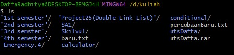
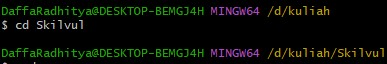
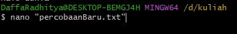

# MSIB SKILVUL #TECH4IMPACT BATCH 4

## Data diri  :rocket:
Nama		:	Daffa Radhitya Pratama Wina. P
NIM			:	A11202012648
Univ.		:	Dian Nuswantoro
Email		:	111202012648@mhs.dinus.ac.id
Track		: Frontend Development
Kel.		: FEBE 13 / FE 2

## Resume week 1
### Unix Command Line

 - SHELL merupakan sebuah program yang mana memungkinkan user untuk memerintah atau berkomunikasi dengan sistem
 - CLI atau kepanjangannya *Command Line Interface* merupakan jenis SHELL yang berupa teks
 - Untuk kita bisa melakukan menuliskan command, kita perlu platform. Terminal emulator merupakan salah satu aplikasi untuk mengakses CLI 
 - File System adalah suatu metode untuk memberikan nama pada sebuah folder dan meletakkannya pada media penyimpanan 
 - Pada file sistem tersebut ada strukturnya yang membuat penyimpanan lebih teratur, hal tersebut dinamakan file system structure
 - Pada sistem operasi windows & unix  -like media penyimpannnya hampir mirip, yaitu seperti bentuk tree 
****
 - Terdapat command atau perintah perintah yang bisa kita gunakan untuk melakukan aksi atau manipulasi, antara lain :
	 - **PWD (*Print Working Directory*)** Command pwd merupakan sebuiah perintah untuk mengetahui dimana path kita berada, ex.

	  	

	 -  **ls (*Lists*)** Merupakan sebuah command untuk melihat apa saja sih file yang ada pada folder yang sedang kita buka, ex.

	 	
	 - **cd (*change directory*)** Merupakan command yang sangat sering digunakan karena digunakan untukberpindah folder / direktori, ex.

		
		
	- **touch** Command touch merupakan perintah untuk membuat sebuah file baru pada direktori, ex.
	

	- **MKDIR (*Make Directory*)** Merupakan sebuah command untuk membuat suatu direktori baru
	- Ada beberapa command untuk membaca sebuah file yang ada pada suatu direktori yaitu **CAT** dimana **CAT** merupakan command untuk melihat semua isi file. Ada juga **HEAD** untuk melihat isi file yang teratas dan **TAIL** melihat yang berada pada line terbawah.

	- Kita juga bisa mengedit isi file dengan command sesuai editor yang akan kita gunakan, ex

		 
		
	- **cp (*Copy*)** Merupakan sebuah command yang kita gunakan untuk mengcopy atau menyalin file atau directory
	- **mv (*Move*)** Kita gunakan command ini untuk memindahkan file atau directory. Selain itu kita juga bisa rename dengan command ini
	- **rm (*Remove*)** Yang terakhir kita bisa memanipulasi dengan menghapus file atau direktori dengan command rm. untuk menghapus file  `rm -R` sedangkan untuk menghapus direktori menggunakan command `rm -d`
	 

