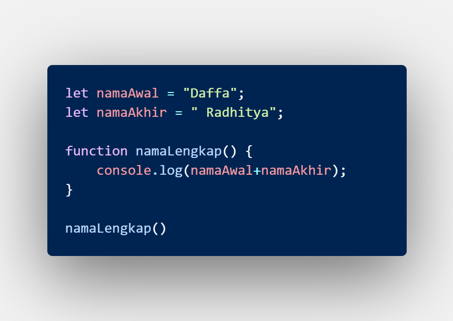
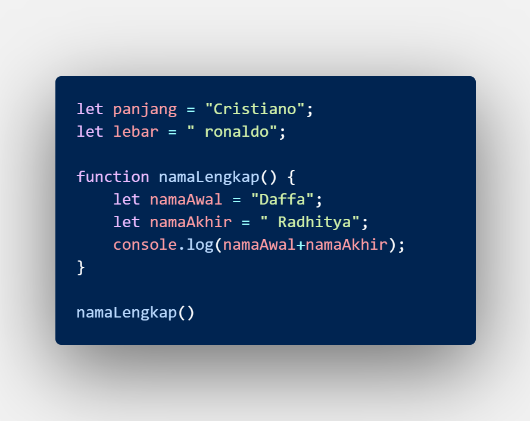
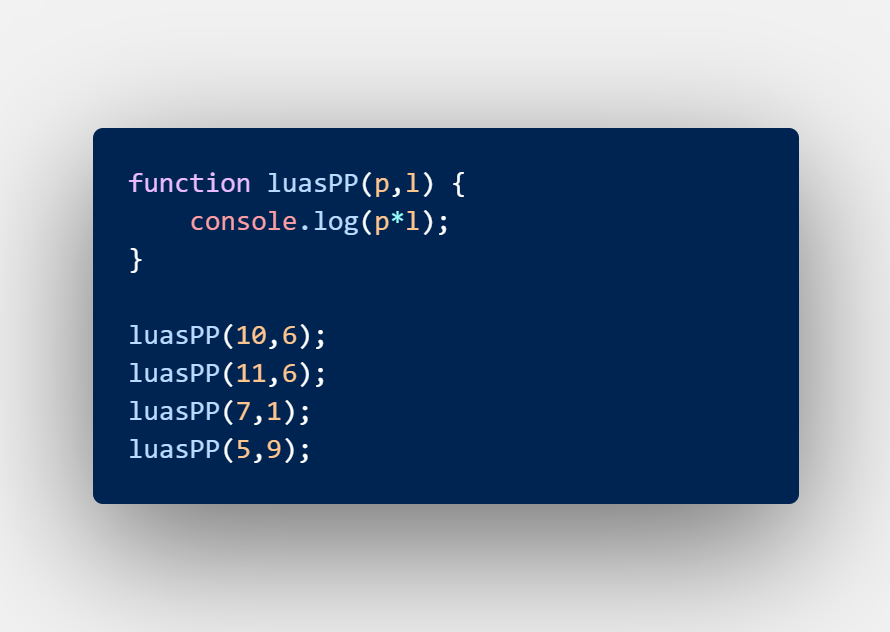
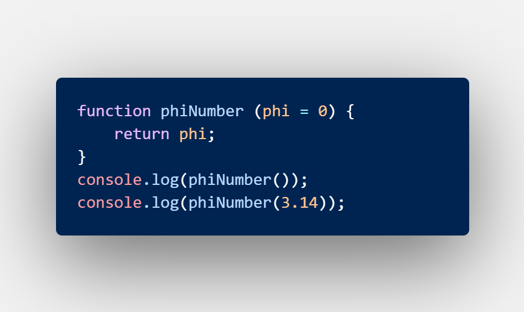
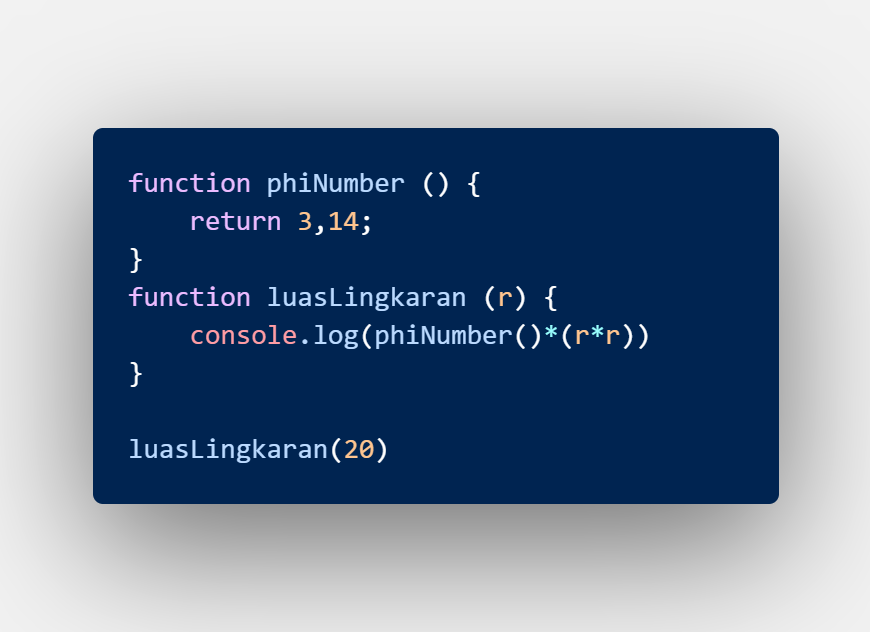
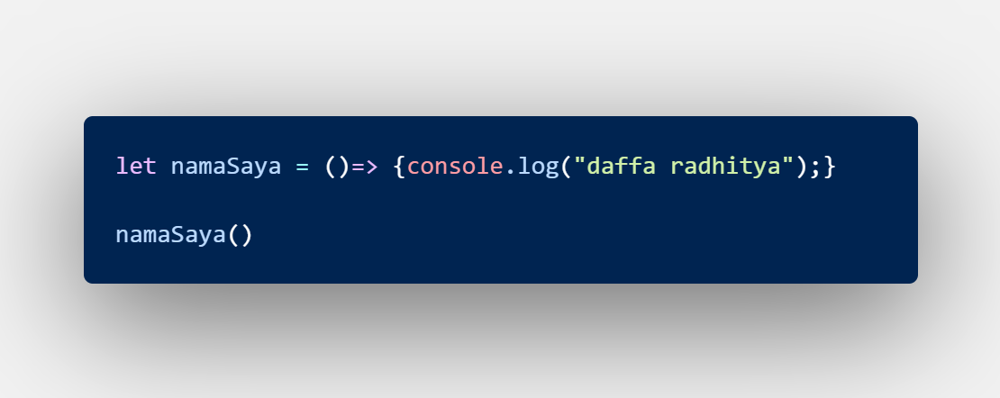


# MSIB SKILVUL #TECH4IMPACT BATCH 3

## Data diri  :rocket:
#### Nama : Daffa Radhitya PWP
#### EMAIL : 111202012648@mhs.dinus.ac.id
#### Univ. Asal : Universitas Dian Nuswantoro
#### Track : Frontend Web Developer
#### Group : FEBE 13 /FE 2
---

## Resume week 2
### Javascript Dasar (Function dan Scope)

 - Javascript sendiri memiliki yang namanya scope. Scope merupakan suatu konsep flow data variabel. Maksudnya konsep itu adalah kita dapat menentukan apakah suatu variabel dapat di akses pada scope tertentu atau tidak.
 - Kalo di analogikan, kita dari berbagai kota di indonesia dapat melihat matahari yang sama namun kita dari berbagai kota di indonesia tidak mungkin melihat salah satu monumen atau bangunan nasional di kota lain dari kota kita asal.
 - Sebelum kita memasuki tentang scope, ada yang namanya `{ }` dinamakan braces.  Nah code yang berada didalam braces terebut dinamakan **block**. Pada looping, dan conditional kemarin kita menggunakan block ini lalu nantinya pada function kita juga akan menggunakan si block ini.
 - Kita masuk pada global scope. Global scope artinya suatu variabel yang bisa kita akses secara bebas didalam suatu file. Nah bagaimana cara kita dapat mendklarasikan global scope ? kita harus mendeklarasikan variabel di luar block tadi agar bisa diakses secara bebas dan termasuk pada global scope.
 - global scope di analogikan seperti tadi di berbagai kota yang berbeda kita dapat melihat matahari yang sama. Jika diimplementasikan dalam codingan javascript, kita dapat mengakses suatu variabel secara bebas bisa untuk function atau cinditional atau proses lainnya.
 - 
 - Selanjutnya selain ada global, javascript juga memiliki local (Local Scope). Local scope sendiri adalah lawan dari global scope tadi yang mana variabel yang kita buat hanya bisa diakses terbatas, bisa khusus hanya di function tertentu, conditional tertentu, atau looping statement tertentu.
 - Berlawanan dengan global scope, local scope berarti kita harus mendeklarasikan didalam block dan tidak akan bisa di akes diluar block.
 - 
 - Setelah kita mengetahui tentang scope, kita akan implementasikan penggunaannya pada function.  Nah function sendiri merupakan sebuah blok code yang menampung suatu intruksi yang nantinya dapat kita gunakan berkali kali
 - 
 - Nah dari gambar diatas sekilas tidak ada masalah dan kita bisa paham bahwa contextnya adalah kita membuat luas PP yaitu panjang x lebar. Nah apabila kita melakukan 3 kali atau lebih dari 3 kali perhitungan luas PP akan memakan banyak line serta membuat kita lelah dan tidak efektif. Maka dari itu function juga membantu kita untuk memudahkan dalam mencoding suatu proses
 - 
 - Lebih ringkas, dan efisien apabila digunakan berkali kali dari gambar diatas menggunakan function
 - Function diatas bisa terlihat terdiri dari beberapa komponen pada syntaxnya yaitu
	 - `function` merupakan keyword function yang menandakan bahwa code ini merupakan function
	 - `luasPP()` yaitu sebuah 	identifier sebagai penamaan function
	 - `{
	 console.log(...)}` merupakan sebuah function body letak statement dan intruksi dimuat 
- Kita bisa menuliskan identifiernya ketika kita ingin memanggil function, contohnya `luasPP()` atau jika tanpa retun console.log bisa `console.log(luasPP())`
- 	 Selanjutnya kita akan membahas hal yang tidak kalah penting dalam function, yaitu parameter dan argumen
- 
- Dari contoh tadi yang merupakan parameter adalah `(p,l)` lalu argumen salah satunya `luasPP(10,6)` yang mana 10,6 merupakan argumen.
- Parameter berfungsi untuk menerima sebuah inputan yang nantinya diolah oleh interuksi lanjut.
- Dari gambar tadi kita bisa tahu bahwa paframeter **p,l** digunakan kembali di function body. Itu yang saya maksud nantinya diolah oleh intruksi lebih lanjut
- Sedangkan argumen bertindak sebagai inputan dari function sebagai pengisi tempat parameter tadi. Dalam kata lain argumen adalah nilai yang digunakan saat memanggil function
- Hal yang harus diperhatikan adalah jumlah argumen harus sama dengan jumlah paramater awalnya
- 
- Lalu pada function juga ada default parameter, bisa terlihat di gambar defaultnya adalah phi = 0 apabila log kan tanpa argumen dia akan menampilkan 0, tapi jika isi argumen 3,14 maka dia akan mengeluarkan nilai 3,14
- Selain default parameter kita juga bisa melakukan yang dinamakan dengan function helper. Artinya kita bisa menggunakan funsi lain untuk fungsi yang berbeda, contohnya 
- 
- Bisa terlihat function phiNumber bisa digunakan untuk function luasLingkaran
- Selanjutnya kita akan mengetahui bagaimana saja pembuatan function
	- function biasa
	
	- Function variabel
	
	- Arrow Function
	
- Mengapa kita harus menggunakan function ? Dengan menggunakan function akan memudahkan kita dalam melakukan debugging atau mentrack letak error pada code kita.
--- s