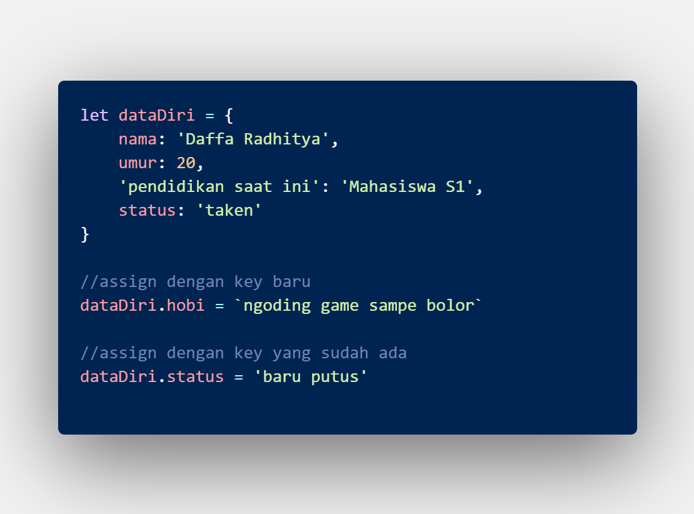

# MSIB SKILVUL #TECH4IMPACT BATCH 3

## Data diri  :rocket:
#### Nama : Daffa Radhitya PWP
#### EMAIL : 111202012648@mhs.dinus.ac.id
#### Univ. Asal : Universitas Dian Nuswantoro
#### Track : Frontend Web Developer
#### Group : FEBE 13 /FE 2
---

## Resume week 3
### Javascript intermediate (Array)

 - Array merupakan salah satu tipe data yang berupa non primitive yang artinya dapat menyimpan berbagai macam tipe data. 
 - Array memiliki urutan yang dapat diakses berupa indeks
 - Indeks array dimulai dari indeks ke- 0

    
 - Cara menampilkan array juga menggunakan indeks sebagai menu item array yang ingin di tampilkan seperti gambar diatas
 - Untuk menampilkan semua isi array kita bisa menggunakan metode looping, beberapa cara looping yang bisa kita gunakan antara lain *for loop*, *for of*, *foreach*, *map*
 - Metode *for loop* merupakan metode sederhana menampilkan semua isi array berdasarkan jumlahnya, ex 
 
 
    
 - Metode *for of* hampir sama dengan for loop namun berbeda syntax. Pada for of kita gunaka array langsung sebagai acuan looping kita, ex
  
 - Metode selanjutnya adalah *foreach*.  Foreach merupakan metode looping yang digunakan untuk menampilkan isi / item array yang akan melakukan perulangan secara otomatis berdasarkan item atau jumlah yang ada di array. Caranya kita menggunakan `array.foreach(function)` yang dimana function berisi intruksi apa yang kita inginkan selama looping. Ex,
  
  
    
 - Metode yang selanjutnya adalah *map*. Metode mapping kita juga bisa gunakan untuk melooping menampilkan isi array dengan otomatis sesuai length atau isi dari array. Bedanya dengan *foreach* adalah mapping dapat melakukan return dan disimpan pada sebuah variabel dan nantinya juga bisa ditampilkan sebagai array jika kita ingin. Ex,
    
    
    
 ---
 ### Javascript intermediate (Object)
 - Selain array sebagai tipe data non primitive, ada juga *object* sebagai tipe data non primitive karena dapat berisi berbagai jenis tipe data di dalamnya. 
 - Berbeda dengan array, object isinya berupa *properti* yang dapat diakses dengan key yang ada di dalamnya.
 - Properti pada javascript berupa `key : value`. key sebagai id yang nantinya akan digunakan untuk mengakses value.
 - Object memiliki synatx sebagai berikut `let obj= {key : value}` contohnya, 
	 
	
- Bisa terlihat juga diatas bahwa key yang digunakan tidak harus berupa kata kuci bisa dengan string juga 
- Selain itu kita pastinya juga bisa mengakses object. Kita memanfaatkan key yang sudah kita buat untuk menampilkan valuenya. `object.key`.
- Ada beberapa cara untuk kita bisa akses antara lain dengan dot notation, bracket, dan ditampung dulu keynya di variabel

	

- Selain itu kita juga bisa asssign value dengan key yang sudah ada atau belum ada,

	

- Kita juga bisa menghapus suatu properti yang ada pada object dengan keyword `delete`, contoh

	

- Selain manipulasi object kita juga bisa mengisi object dengan sebuah function, contoh

	

- Selain itu di dalam object juga bisa berisi object (nested object). Untuk mengaksesnya kita harus memahami alur jalan nestednya, untuk lebih jelas bisa melihat gambar dibawah

	

- Selain nested object, kita bisa menggabungkan array yang di dalamnya object (array of object). Cara aksesnya bisa kita kombinasikan indeks untuk array dan key untuk object, contoh

	

- Setelah kita tahu nih apa itu object, isinya bisa apa aja, lalu cara manipulasi isinya bagaimana, kita juga perlu tahu bagaimana menampilkan semua isi yang ada pada object. Kita bisa menggunakan looping dengan *for in loop*,  untuk lebih jelas kita bisa lihat gambar dibawah

	

	
---
### Javascript intermediate (Modules)
- Modules merupakan cara yang dapat memungkinkankita untuk bisa menggunakan variable, function, dsb dari file javascript yang berbeda.
- Hal ini terjadi karena modules adalah cara untuk memisahkan file javascript kita
- Dengan modules, kita bisa lebih mengelola file dan membuat file javascript kita tidak terlalu menumpuk
- Pada modules kita akn 2 keyword ajaib yaitu `export` dan `import`
- Keyword *export* berati kita memungkinkan file javascript kita bisa diakses oleh file javascript yang berbeda.
- Sebelum kita melakukan export import kita perlu mendefinisikan bahwa kita akan menggunakan modules di page HTML dengan `type= "module" `

	
	
- Kita perlu membuat syntax `export{yang mau di export}`, contoh

	

- Setelah kita export, kita perlu mendapatkan dengan keyword *import* . Untuk syntax import : `import {yang ingin kita ambil} from  'file export tadi';` contoh :

	
- selain itu kita juga bisa mengganti nama variable yang kita export import dengan keyword `as`, contoh

	

	

---
### Javascript intermediate (Recursive)
- Recursive merupakan sebuah fungsi (function) yang memanggil dirinya sendiri untuk menyelesaikan suatu task
- Pada recursive terdapat 2 bagian yaitu, *base case* dan *recursion case*. 
- Base case adalah titik paling sederhana yang bisa kita lakukan
- recursion case adalah titik dimana function mulai memanggil dirinya sendiri untuk menyelesaikan tasl
- Contoh case adalah menampilkan deret angka 1 2 3 dst

	
---
### Javascript intermediate (Asynchronous, callback, dan promise)
- Asynchronous merupakan sebuah sifat yang dimiliki javascript yang dimana artinya javascript memperbolehkan antrian operasi atau task disela apabila task sebelumnya memakan waktu yang relatif lama dan memanggil kembali task yang lama tadi apabila task yang lain sudah selesai .
- Dia (javascript) akan meletakkan task yang memakan waktu itu kedalam callback queue. Setelah itu javascript akan melakukan task lainnya dan apabila sudah akan memanggil task yang memakan waktu lama tadi (asynchronous).

	

	

- Diatas merupakan scheme / skema dalam proses asynchronous dan contoh coding
- Setlah kita tau proses asynchronous, selanjutnya kita belajar tentang konsep callback. Callback adalah cara dimana kita membuat function sebagai argumen function lain.
- Biasanya kita hanya membuat argumen berupa nilai yang memang jita inginkan atau kita expect, namun denga callback kita bisa menggunakan function sebagai argumen, contoh 

	

- Lalu selanjutnya adalah promise. Promise merepresntasikan sebuah penyelesaian task (atau bisa saja gagal) oleh sebuah proses asynchronous.
- Intinya promise akan menangkap kejadian yang terjadi selama kita melakukan proses asynchronous baik sukses atau berhasil
- Ada 3 tahapan dalam promise yaitu **pending**,**rejected**,**fullfiled**.
- Pending itu ketika di fase insialisasi atau masi dalam proses *either* diterima atau ditolak
- Rejected merupakan fase dimana task gagal atau tidak tepenuhi
- Fullfiled adalah fase diman task berhasil dan yang expect terpenuhi

	

- Untuk syntax dari promise sendiri kita menggunakan `new promise((resole,reject){})`
- Nah disini kita akan lagi lagi menggunakan konsep callback nantinya, agar lebih jelas bisa lihat gambar dibawah

	
- Bagaimana jika kondisi gagal ? Bisa terlihat bahwa terdapat keyword `.catch`. Dia akan memberikan pesan error dari reject promise
- Terlihat juga terdapat code `console.log("pertama");` dan `console.log("kedua");`. Karena promise memakan waktu maka javascript akan lebih dahulu mengeksekusi kedua code tersebut setelah itu memanggil kembali proses promise
---
### Javascript intermediate (Web Storage)
- Web storage merupakan penyimpanan default yang berada pada browser kita
- Web storage biasanya terdapat di `inspect > application > storage`
- Webs storage ada 3 yaitu **local storage**,**session storage**,**cookies**.
- Cookies sudah banyak di tinggalkan semenjak html 5, karena limit sizenya yang kurang dibandingkan local dan session storage
- Perbedaan antara local dan session storage adalah apabila local itu data simpanannya akan bertahan terus meskipun kita close website atau bahkan browser kita. Sedangkan session hanya akan tersimpan selama kita mengakes website tersebut.
- Untuk local storage sendiri memiliki 2 object yang sering digunakan yaitu `set item` dan `get item`
- get item untuk mengambil data di local storage sedangkan set item menambahkan data di local storage
- Local storage bisa diakses dengan sebuah key. Key tersebut nantinya digunakan sebagai kode unik untuk mengakses data local storage kita.
- Untuk lebih paham kita akan menggunakan study case aplikasi untuk abses pegawai, bisa dilihat pad agambar dibawah
- HTML
	
- JS
	
- Hasilnya 
	
