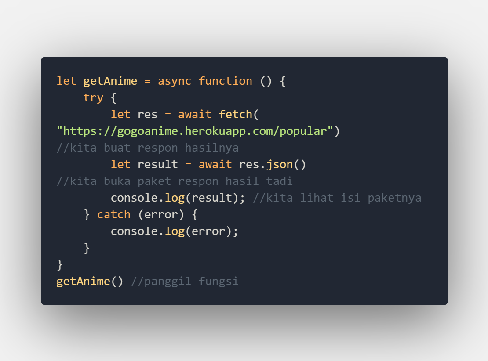
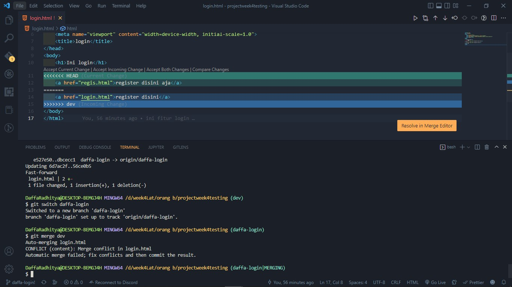

# MSIB SKILVUL #TECH4IMPACT BATCH 3

## Data diri  :rocket:
#### Nama : Daffa Radhitya PWP
#### EMAIL : 111202012648@mhs.dinus.ac.id
#### Univ. Asal : Universitas Dian Nuswantoro
#### Track : Frontend Web Developer
#### Group : FEBE 13 /FE 2
---

## Resume week 4
### Javascript intermediate (Async - Await dan fetch API)

 - Setelah pada modul sebelumnya kita mengetahui konsep asyncrhonous lalu ada juga pembuatan promise serta cara menangkap kondisinya dengan then catch. Selanjutnya kita akan belajar cara lain untuk bisa menangkap promise yang sudah kita buat yaitu dengan async await
 - Perbedaan yang paling mendasar pada async await dengan then catch adalah penggunaan async await yang dimasukkan pada sebuah function. 
 - Selain itu async await juga perlu menggunakan keyword `async` pada function dan `await` serta meminta respon berbeda dengan then catch kemarin
 - Agar lebih jelas kita lihat gambar dibawah
	 
- Kita masi menggunakan promise bermain bola dari module kemarin. Kita bisa lihat bahwa pada function `mainBolaAwait()` kita memberi keyword `async` disana untuk menandakan kita akan menggunakan metode async await kali ini
- Pada isi function bisa terlihat juga keyword try catch. Try catch disini digunakan untuk menaangkap respon dari promise. Try akan menangkap apabila tidak error dan apabila error akan masuk ke catch.
- Setelah itu kita juga bisa melihat `let nilai =  await mainBola`. Line code tersebut digunakan untuk mendapatkan respon dari promise yang sudah kita buat. Keyword await akan mengambil hanya pada function dengan kode `async`  yang berati function async await. 
- Dari code diatas akan terlihat bahwa hasilnya adalah error yang akan menampilkan output  ***kita pending ygy***
- Setelah kita bisa mengambil respon dan mengandel sebuah asynchronous. Kita bisa menggunakan 2 hal tersebut untuk melakukan *fetch* untuk API. API itu apasih ?
- API atau *Application Prorgamming Interface* merupakan sebuah  interface yang dapat digunakan sebagai penghubung antar aplikasi.
- Simpelnya API ini bertincak sebagai *jembatan* yang dapat menghubungkan aplikasi lain dengan aplikasi yanng mungkin kita  kembangkan
 
- Dari gambar diatas bisa terlihat bahwa proses request dan mendapatkan data terlihat seperti diatas.
- Kita akan meminta data terlebih dahulu dan nanti data dicarikan oleh server di database lalu jika ketemu data akan dikembalikan oleh server dan ditampilkan di client side atau ke kita
- Apabila di analogikan kiat memesan makanan maka dapur dan kulkasnya adalah server dan database. Lalu apa peran API ?
- API akan bekerja sebagai perantara untuk menyampailan request dan apa yang sudah kita request. Masuk analogi API akan menjadi seorang pelayan apabila seperti analogi kita tadi
- API biasanya berbentuk URL yang isinya berupa data data yang disimpan dalam format JSON
- JSON sendiri merupakan sebuah javascript object notation yang berbasis teks yang biasanya digunakan untuk pertukaran data (umumnya)
- Fetch sendiri sangat simple penggunaannya hanya dengan `fetch(url)`
- Agar lebih jelas kita akan langsung mencoba fetch dengan juga memanfaatkan then catch dan juga async await.
	1. Yang pertama kita perlu mencari url API apa yang akan kita gunakan. Disini saya akan mencoba menggunakan API dari [gogoanime](https://gogoanime.nl/) yang berisi list anime anime populer saat ini
	2. Setelah mendapatkan [URL nya ](https://gogoanime.herokuapp.com/popular) bisa kita lihat terlebih dahulu isinya biasanya berupa JSON
	
	3. Setelah itu kita akan masukkan ke code kita untuk mendapatkan list datanya
	4. Kita bisa menggunakan then catch untuk mendapatkan isi dari url yang kita fetch
	
	
	5. Selain then catch kita coba gunakan async await
	
	
- Dengan data data yang sudah kita dapatkan nantinya kita bisa tampilkan data data tersebut tergantung data apa yang kita inginkan. Contoh menggunakan yang async - await aku ingin nampilin nama nama animenya kita bisa gunakan looping foreach atau map untuk nampilin nama namanya dengan tahun rilisnya, contoh
 
 
- Karena kita mendapatkan dara array of object, berdasarkan module sebelumnya kita bisa gunakan map array untuk looping dan dot notation untuk memilih value dari objectnya
- Selanjutnya data data tersebut kita bis ainject ke halama HMTL kita dengan DOM yang sudah kita pelajari sebelumnya
---
### Git dan Github Lanjutan
- Pada module module sebelumnya kita sudah mempelajari penggunaan git dan github seperti metode push, remote, dan juga commit. Selanjutnya kita akan belajar lanjutannya.
- Lanjutannya adalah dimana kita memanfaatkan git dan github untuk melakukan kolaborasi dengan sebuah tim atau kelompok. Jadi jika kita memosisikan diri sebagai anggota tim kita perlu memahami cara kerja git dan github untuk kita bisa menggunakan bersama.
- Ada beberapa hal yang harus di pahami sebelum mempelajari kolaborasi disini yaitu kita perlu memahami tentang konsep commit, remote, push pada materi sebelumnya agar memudahkan dalam kolaborasi nantinya
- Ada beberapa step yang harus kita lakukan sebelum berkolaborasi dengan github
	- Membuat organization
		
	- Invite anggota kelompok / tim
		
	- Membuat repo baru dan push
		
	- Membuat branch baru selain `main` untuk development step. Biasanya diberi nama branch `dev`
	
- Step step diatas adalah hal yang perlu kita siapkan sebekum berkolaborasi. Nah selanjutnya kita sebagai tim harus ngapain ?. Kita sebagai tim yang nantinya akan mengerjakan projek kita perlu mengikuti step step yang ada, antara lain :
	- Meng -clone repo yang sudah ada 
		
	- Setelah setiap orang clone, kita perlu membuat branch baru dari dari branch `dev` untuk develop fitur sesuai yang ditugaskan . Cara menamabahkan branch baru dari dev adalah kita perlu switch branch ke `dev ` lalu gunakan command `git branch [nama branch]`
		
	- Setelah kita buat branch baru, bisa kita switch ke branch tersebut lalu develop sesuai fitur yang sudah di tugaskan ke kita
		
	- Setelah itu kita bisa push seperti biasa pada module git dan github dasar
		
	- Setelah itu kita meminta `pull request`. Apa itu pull request ? Pull request itu seolah olah kita meminta izin untuk menggabungkan apa yang sudah kita buat ke branch tertentu
		
	- Nah nantinya team lead akan bisa meng - acc pull request anggoota tim untuk bisa menggabungkan ke branch dev
		
- Nah bagaimana jika kita ingin lingking ke file orang atau anggota tim lain ?. Disini kita akan berkenalan dengan command `pull` dan `merge`
- Hal yang pertama harus dilakukan adalah 
	- Kita cek terlebih dahulu apakah file di branch `dev` sudah ada atau belum muncul, jika belum kkita bisa gunakan command `git pull`. Git pull merupakan command yang mudahnya seperti refresh data agar bisa terbaca 
		
	- Setelah muncul seperti diatas isi nya dev bisa muncul semua, kita switch kembali ke fitur dan kita merge data dev. `git merge [branch]`digunakan untuk membandingkan dan mendapatkan file dari branch tertentu
	-  Setelah data diatas terlihat bisa kita olah bisa kita linking kita push seperti awal tadi dan juga jangan lupa untuk meminta pull request dan untuk team lead meng acc apabila sudah fix 
- Pada kolaborasi dengan github tidak menutup kemungkinan adanya beberapa kesalahan atau biasanya kita sebut **conflict**
- Conflict merupakan sebuah kesalahan dalam kolaborasi yang mengakibatkan tidak bisa merge ke suatu branch. Biasanya karena duplikat file, duplikat isi file dsb. 
- conflit harus diselesaikan sebelum merge, saya akan contohkan kejadian conflict
	- Anggota tim lain mengerjakan file yang dikerjakan tim lain jadi saat pull request dengan file yang sama tapi isinya beda
		
	- Pada saat pull request akan muncul tanda merah kalo ada conflict 
		
	- Bisa tetap di pull request tapi team lead akan memberikan komen untuk diperbaiki
	- Kita bisa solve conflict tadi dengan kita merge yang sudah ada di dev lalu kita bisa pilih ingin yang code baru atau yang lama untuk diterima perubahnnya 
		
	- Nantinya kita sudah bisa pull request seperti biasa

---
### Responsive Web Design
- Agar website kita lebih maksimal kita perlu membuat website kita lebih responsif. Apa itu responsif ?
- Responsif merupakan suatu konsep dimana website kita dapat diakses dengan baik dan terlihat jelas di berbagai platform selain desktop.
- Secara kata lain, responsif nantinya mendukung website kita dapat di akses di platform lain seperti phone, tablet, dsb.
- Pada html dan css ada beberapa styling yang bisa kita gunakan untuk mendukung responsif antara lain : `meta viewport`, `max-width`, menggunakan relative unit, media query css.
- meta viewport adalah sebuah tag meta yang dapat digunakan untuk membantu membuat website kita lebih  repsonsive.
- cara kerja meta viewport yaitu mengikuti ukuran device yang nantinya kita gunakan dengan cara mengecilkan konten sesuai ukuran viewport / device
- Selanjutnya ada `max-width`. Max width akan membuat konten / elemen kita sebesar maksimal yang kita inginkan. 
- Kita coba dengan memberika properti `max-width : 50%;` yang berarti dimanapun ia berada akan mengikuti ukuran 50% widthnya sesuai parent

	

	

- Kita bisa melihat bahwa apabila kita kecilkan ukuran viewport dan ukuran dari container akan terus berukuran maksimal 50% apabila kurang dari 50% max width tidak akan berefek apa apa
- Selanjutnya kita akan membahas tentang unit css. Unit css merupakan sebuah standart pengukuran yang ada di css.
- Unit css ada 2 jenis, **absolute**  dan **Relative** . Apa sih bedanya absolute dan relative sizing units ?
- Absolute artinya ukurannya baku atau tidak bisa berubah. Maksudnya apabila kita menggunakan absolute unit kita tidak secara mudah mengubah ukurannya secara kata lain fixed. Yang tergolong absolute units adalah pixel (px), inch (in), picas (pc), serta point (pt)
- Untuk relative adalah artinya ukuran yang kita bisa fleksibel mengikuti sesuatu. Bisa dikatakan ukurannya akan relatif terhadap suatu elemen atau yang lainnya. yang tergolong relatif units antara lain rem (relatif terhadap root element), em (relatif terhadap parent) , vh( relatif terhadap viewport height), vw (relatif terhadap viewport weight), dan juga %. Agar lebih mengetahui perbedaannya kita bisa lihat dibawah 

	

	
- Dari ilustrasi bisa terlihat perbedannya apabila kita menggunakan pixel yang mana sangat fixed dan tidak terpengaruh ukuran apapun. Sedangkan saat kita menggunakan em dan rem dia akan relatif terhadap sesuatu
- Rem akan relatif terhadap ukuran root yang mana ukurannya 16 px maka dia akan berukuran 32px (16 x 2) pixel
- Sedangkan em dia akan relatif terhadap ukuran default yang ada di div yaitu 20 maka ukuran em akan 2 kali 20 yaitu 40 px
- Selanjutnya setelah kita mengetahui satuan ukurannya. Kita bisa menggunakan media query untuk membuat website lebih responsif.
- Media query adalah salah satu cara yang bisa kita lakukan untuk mengubah suatu style pada breakpoint tertentu. Apa itu *breakpoint* ?.
- Breakpoint adalah sebuah *patahan* pada saat kita mengecilkan ukuran viewport kita. Patahan tersebut nantinya kita gunakan sebagai ukuran untuk pacuan kita merubah style

	

- Pada gambar diatas bisa terlihat bahwa ukuran lebar viewport maksimal 600px dia akan merubah style dari div dengan class container displaynya none (atau menghilang)
- Agar kita bisa lebih efektif dalam pembuatan responsif website kita bisa memanfaatkan framework seperti bootstrap agar bisa lebih mudah dan cepat. Selanjutnya kita akan belajar pemanfaatan bootstrap.
----
 ### Bootstrap
 - Bootstrap merupakan sebuah framework yang akan memudahkan kita dalam membuat website lebih responsif. Kenapa ?
 - Karena bootstrap merupakan framework yang *mobile first* yang artinya memprioritaskan penggunaan website untuk device mobile selain desktop
 - Untuk bisa menggunakan bootstrap kita perlu includekan sebuah link css dan js yang akan membantu kita generate style bootstrap kita

 	
 - Dalam pembuatannya bootstrap menggunakan *grid system* yang mana menggunakan teori flexbox.
 - Pada pembuatan grid system kita perlu menggunakan class container sebagai pembungkus diikuti col sebagai awal dan row sebagai item itemnya. Agar lebih jelas mari kita lihat codingan dibawah

 	
	

 - Bisa terlihat juga bahwa grid system bootstrap menggunakan sistem yang terdiri dari 12 col maksimal. Maka ita bisa modif col tersebut dengan kombinasi yang akan menciptakan 12 col. Syntaxnya seperti diatas `col-(jumlah col)`. 
 - Selain itu kita bisa juga perlu menngetahui breakpoint yang ada pada bootsrap. PAda bootsrap breapoint menggunakan sm (small viewport), md (medium viewpor), xl (xtra large viewport), xxl (xtra extra large viewport)

 	  
 
 - Nantinya kita juga bisa menggunakan breakpoint ini kedalam col kita tadi. 

	

	

- Bisa terlihat bahwa col diatas akan berubah saat breakpoint sm menjadi size auto (yang artinya size dari col widthnya mengikuti konten) dan dia akan menjadi col-12 (mengisi 12 col sehingga col item yang lain dipakasa pindah kebawah) apabila ukuran viewport md keatas
- Setelah kita paham grid system selanjutnya kita bisa tinggal menggunakan component component yang ada pada bootstrap.  Seperti carrousel, navbar, card, dst

	

- Pada bootsrap umumnya kita tinggal copy paste codingan yang sudah disediakan tapi kita juga perlu paham struktur dan bentuknya agar kita tidak langsung copas.
