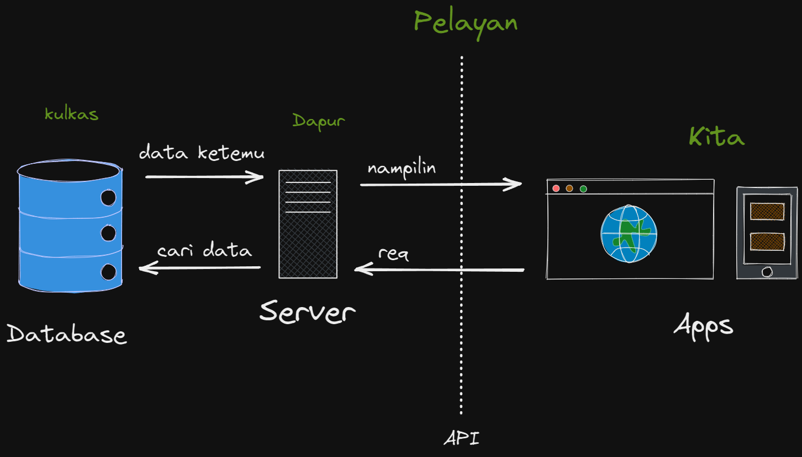

# MSIB SKILVUL #TECH4IMPACT BATCH 3

## Data diri  :rocket:
#### Nama : Daffa Radhitya PWP
#### EMAIL : 111202012648@mhs.dinus.ac.id
#### Univ. Asal : Universitas Dian Nuswantoro
#### Track : Frontend Web Developer
#### Group : FEBE 13 /FE 2
---

## Resume week 4
### `Javascript intermediate` (Async - Await dan fetch API)

 - Setelah pada modul sebelumnya kita mengetahui konsep asyncrhonous lalu ada juga pembuatan promise serta cara menangkap kondisinya dengan then catch. Selanjutnya kita akan belajar cara lain untuk bisa menangkap promise yang sudah kita buat yaitu dengan async await
 - Perbedaan yang paling mendasar pada async await dengan then catch adalah penggunaan async await yang dimasukkan pada sebuah function. 
 - Selain itu async await juga perlu menggunakan keyword `async` pada function dan `await` serta meminta respon berbeda dengan then catch kemarin
 - Agar lebih jelas kita lihat gambar dibawah
	 
- Kita masi menggunakan promise bermain bola dari module kemarin. Kita bisa lihat bahwa pada function `mainBolaAwait()` kita memberi keyword `async` disana untuk menandakan kita akan menggunakan metode async await kali ini
- Pada isi function bisa terlihat juga keyword try catch. Try catch disini digunakan untuk menaangkap respon dari promise. Try akan menangkap apabila tidak error dan apabila error akan masuk ke catch.
- Setelah itu kita juga bisa melihat `let nilai =  await mainBola`. Line code tersebut digunakan untuk mendapatkan respon dari promise yang sudah kita buat. Keyword await akan mengambil hanya pada function dengan kode `async`  yang berati function async await. 
- Dari code diatas akan terlihat bahwa hasilnya adalah error yang akan menampilkan output  ***kita pending ygy***
- Setelah kita bisa mengambil respon dan menghandle sebuah asynchronous. Kita bisa menggunakan 2 hal tersebut untuk melakukan *fetch* untuk API. API itu apasih ?
- API atau *Application Prorgamming Interface* merupakan sebuah  interface yang dapat digunakan sebagai penghubung antar aplikasi.
- Simpelnya API ini bertincak sebagai *jembatan* yang dapat menghubungkan aplikasi lain dengan aplikasi yanng mungkin kita  kembangkan
 
- Dari gambar diatas bisa terlihat bahwa proses request dan mendapatkan data terlihat seperti diatas.
- Kita akan meminta data terlebih dahulu dan nanti data dicarikan oleh server di database lalu jika ketemu data akan dikembalikan oleh server dan ditampilkan di client side atau ke kita
- Apabila di analogikan kiat memesan makanan maka dapur dan kulkasnya adalah server dan database. Lalu apa peran API ?
- API akan bekerja sebagai perantara untuk menyampailan request dan apa yang sudah kita request. Masuk analogi API akan menjadi seorang pelayan apabila seperti analogi kita tadi
- API biasanya berbentuk URL yang isinya berupa data data yang disimpan dalam format JSON
- JSON sendiri merupakan sebuah javascript object notation yang berbasis teks yang biasanya digunakan untuk pertukaran data (umumnya)
- Fetch sendiri sangat simple penggunaannya hanya dengan `fetch(url)`
- Agar lebih jelas kita akan langsung mencoba fetch dengan juga memanfaatkan then catch dan juga async await.
	1. Yang pertama kita perlu mencari url API apa yang akan kita gunakan. Disini saya akan mencoba menggunakan API dari [gogoanime](https://gogoanime.nl/) yang berisi list anime anime populer saat ini
	2. Setelah mendapatkan [URL nya ](https://gogoanime.herokuapp.com/popular) bisa kita lihat terlebih dahulu isinya biasanya berupa JSON
	
	3. Setelah itu kita akan masukkan ke code kita untuk mendapatkan list datanya
	4. Kita bisa menggunakan then catch untuk mendapatkan isi dari url yang kita fetch
	
	
	5. Selain then catch kita coba gunakan async await
	
	
- Dengan data data yang sudah kita dapatkan nantinya kita bisa tampilkan data data tersebut tergantung data apa yang kita inginkan. Contoh menggunakan yang async - await aku ingin nampilin nama nama animenya kita bisa gunakan looping foreach atau map untuk nampilin nama namanya dengan tahun rilisnya, contoh
 
 
- Karena kita mendapatkan dara array of object, berdasarkan module sebelumnya kita bisa gunakan map array untuk looping dan dot notation untuk memilih value dari objectnya
- Selanjutnya data data tersebut kita bisa inject ke halama HMTL kita dengan DOM yang sudah kita pelajari sebelumnya
---
