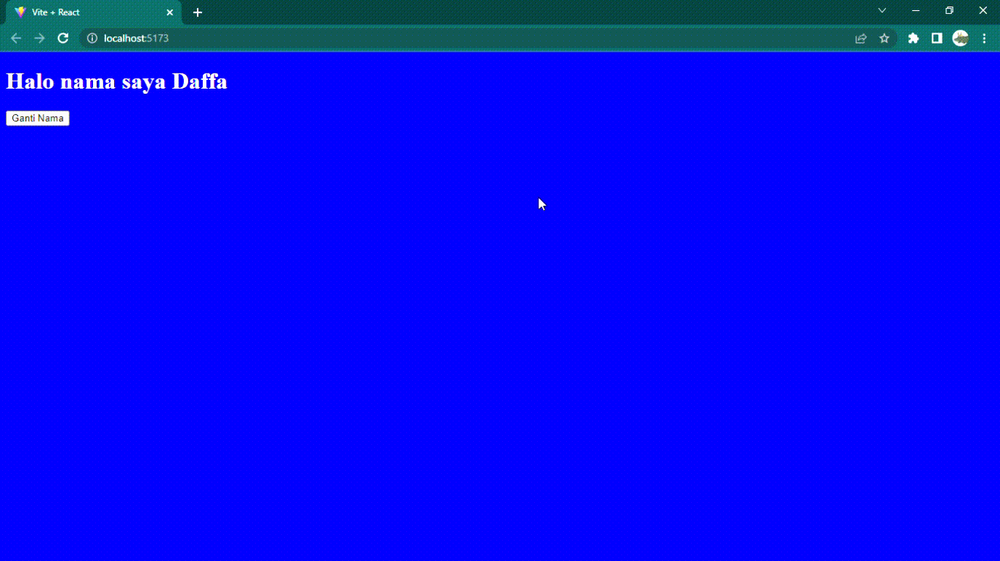

# MSIB SKILVUL #TECH4IMPACT BATCH 3

## Data diri  :rocket:
#### Nama : Daffa Radhitya PWP
#### EMAIL : 111202012648@mhs.dinus.ac.id
#### Univ. Asal : Universitas Dian Nuswantoro
#### Track : Frontend Web Developer
#### Group : FEBE 13 /FE 2
---

## Resume week 6
### React  JS Basic (Intro To React)
- Setelah pada minggu - minggu sebelumnya kita belajar tentang web basic (HTML, CSS, JS) lalu ada juga Javascript lanjutan juga, sekarang kita akan belajar salah satu pemanfaatan javascript yaitu menggunakan React JS

> React JS merupakan sebuah library dan framework dengan basis javascript yang di fokuskan untuk membuat sebuah tampilan *"client-side"* dari sebuah website
- React js dikembangkan oleh Facebook pada tahun 2011 dan baru pada 2 tahun selanjutnya dikenalkan secara umum
- React Js sendiri merupakan framework yang *declarative*. Maksudnya adalah react sangat mudah untuk diperintah gampangnya seperti itu atau kita bisa menuliskan kode sesuai apa yang ingin kita buat
- Selain itu react js juga merupakan framework yang *component based*. Maksudnya react sendiri terdiri dari didalamnya tersusun dari berbagai *component* yang sangat mudah kita gunnakan. Apa itu component ? akan kita pelajari setelah ini
- Selain itu react juga cepat jika dibandingkan dengan menggunakan Javascript DOM biasa karena pada react js dia menggunakan virtual DOM
- Selanjutnya kita akan mencoba membuat file react kita pertama kali.
- Dalam pembuat file react kita bisa menyebutnya dengan istilah "Create React App". 
- Sebelum create react app kita perlu terlebih dahulu menggunakan atau install node js sebagai package manager kita yang membuat kita bisa install via npm command
- Untuk create react app kita mempunyai beberapa cara, umumnya kita langsung menggunakan `npx create-react-app [name-project]` atau kita bisa menggunakan vite js dengan cara `npm create vite@latest [nama-project] --template react
`
- Disini saya akan mencontohkan menggunakan vite js dikarenakan lebih cepat dan menghemat waktu saat membuatnya
- 
- Untuk tes apakah kita sudah work file react kita, kita bisa langsung coba dengan command `npm run dev`
	 

	
- Untuk struktur dari file react sendiri nantinya kita akan bermain pada folder *src* 
- Pada react kita tidak akan bermain dengan folder html dan juga js utama, nantinya kita akan menggunakan app.js
	
	
- Untuk ekstensi jsx sendiri artinya kita menggunakan *javascript xml* agar kita bisa menyisipkan unsur unsur html pada javascript
- Selanjutnya kita akan melihat kedalam file app.jsx
- 
- Pada file app js diatas kita bisa lihat bahwa pada file app jsx kita, menggunakan function sebagai isi utamanya. Jika ada function kita bisa menggunakan return untuk mengembalikkan nilai
- Selain itu apabila kita ingin menambahkan suatu html kita bisa menggunakan yang ada di dalam return
- Namun kita harus mengingat bahwa apabila kita ingin menyisipkan sebuah html kita perlu membungkusnya pada sebuah root atau parent yang hanya satu jumlahnya
- Simplenya kita tidak bisa mempunyai elemen lebih dari satu di dalam komponen, pada app.jsx bisa terlihat bahwa file html nantinya akan dimasukkan kedalam div 
- Selanjutnya kita akan bahas lebih lanjut tentang file file pada react pada materi component.
---
### React  JS Basic (Component, Props dan State)
- Sebelumnya kita sudah belajar tentang apasih itu react, lalu belajar bagaimana create react app membuat file proyek react baru, lalu juga kita melihat struktur file yang ada di react dan juga isi dari App.jsx yang dimana akan kita buat untuk membuat file disitu.
- Pada kali ini kita akan belajar tentang component terlebih dahulu sebelum kita akan bermain dengan props dan state.
- Untuk react sendiri karena merupakan  *component based* berarti kita bisa menggunakan komponen komponen didalamnya
- Komponen sendiri merupakan sebuah file jsx yang kita buat sendiri untuk menyusun page website kita yang ada pada file app.jsx
- Simplenya komponen merupakan sebuah template yang kita buat untuk nantinya kita bisa tempel di app.jsx sesuai kebutuhan kita.
- Untuk membuat komponen kita bisa buat folder pada src dan kita isi file didalamnya
- 
- Bisa terlihat bahwa setiap kita membuat sebuah komponen isinya adalah sebuah function (karena kita menggunakan function component) yang mana isinya adalah sebuah return html yang harus kita bungkus di dalam satu root parent element
- Pada komponen Name.jsx, bisa terlihat bahwa selain kita membungkus sebuah html dengan sebuah div kita juga bisa menggunakan yang dinamakan *react fragment* bentuknya `<>[isi html]</>`
- Setelah itu pada app.jsx kita bisa melihat cara menampilkan komponennya dengan syntax `<namakomponen/>`
- 
- Implementasinya bisa saja kita buat untuk sebuah navbar atau footer yang nantinya kita tinggal tempel saja ke app.jsx tidak perlu copas copas perhalaman dikarenakan nantinya kita menggunakan yang namanya konsep *SPA* yaitu *Single Page Application*
- Lalu kita sudah belajar html, untuk css untuk styling bagaimana ?
- Kita bisa manfaatkan sebuah file css yang ada nantinya kita import kedalam app.jsx. Contoh, 
-  
- Kita sudah belajar mengenai komponen pada react selanjutnya kita akan berkenalan dengan salah satu basic react yang penting yaitu props dan state.
- Sejatinya props dan state digunakan agar saat kita menggunakan data bisa lebih dinamis
- Props sendiri simpelnya adalah data yang dijadikan argumen untuk bisa diteruskan dari suatu komponen ke komponen lainnya.
- Untuk menggunakan props kita bisa menggunakan syntax `<namaKomponen key={value}/>` untuk fase mengirim, dan `props.value` untuk mendapatkan datanya 
- Kenapa kita menggunakan `{_}` ?, pada jsx kita perlu menggunakan curly bracket untuk mendifinsikan sebuah javascript didalamm return function sehingga bisa dibedakan
- Kita bisa menggunakan props untuk bermain dengan props, namun disini saya akan membuat komponen baru untuk bermain props, contoh
- 
- Bisa terlihat untuk kita bisa mengoper sebuah data kita harus terlebih dahulu mengimpor komponen tujuan agar bisa ditangkap nantinya
- Selain itu kita juga bisa melihat untuk props menggunakan dot notation dengan key-nya karena props bentuk berupa object
- Selanjutnya dengan menggunakan props kita bisa mengirim data ke komponen lain
- Setelah kita mengetahui menampung data dengan sebuah props selanjutnya kita akan belajar tentang state.
- State sendiri merupakan penampung data seperti halnya variabel yang ada pada sebuah komponen
- Konsepnya mirip seperti props, tetapi hanya digunakan pada komponen itu saja
- Namun pada react biasanya state biasa tidak dapat berubah atau *"immutable"* maka dari itu biasanya kita menggunakan hook yaitu *useState*
- UseState sendiri merupakan bawaan dari react yang memungkinkan kita dapat mengubah suatu data di state tersebut
- Syntax dari useState sendiri yaitu `const[data,setData] = useState(datanya)` agar lebih paham kita contohkan langsung
 
	 
	 
- Untuk perubahan useState sendiri harus dipancing atau harus menggunakan trigger agar bisa melakukan sebuah set atau ganti data, tapi kita akan bahas lebih lengkap di materi selanjutnya tentang event disini intinya kita akan lebih berfokus untuk pembuatan state dengan hook useState
- Terlihat juga kita harus melakukan import untuk useState sebelum menggunakan useState
---
### React  JS Basic (Event, Conditional Rendering)
- Setelah sebelumnya kita sudah belajar tentang komponen dalam javascript modelnya seperti apa lalu bagaimana cara menampilkan komponen serta apa itu state dan props. Kita juga menyinggung sedikit tenntang event karena pada penggunaan useState kita harus memiliki trigger untuk bisa mengubah suatu data mau tidak mau kita menggunakan event (onclick disitu)
- Kali ini kita akan belajar tentanng event, mungkin seiring berjalan materi kita akan bertemu event event lainnya, disini kita akan fokus tentang bagaimana event bekerja
- Event sendiri sebelumnya sudah pernah kita pelajari pada javascript DOM yang mana biasanya kita gunakan untuk mengubah, manipulasi, atau bahkan membuat form. 
- Kali ini sedikit perbeda penggunaan event, contohnya dari syntaxnya sendiri `<Button onClick={()=>(isiPerintah)}><Button/>`
- Kita bisa menggunakan sebuah callback juga untuk kali ini. selain itu sudah dibahas sebelumnya tentang curly bracket. Itu untuk mendefinisikan sebuah javascript di return function component.
- Sebelum kita masuk ke codingan kiat akan membahas sedikit tentang conditional rendering
- Conditional rendering sendiri merupakan sebuah konsep yang dapat membantuu kita untuk menampilkan sebuah konten atau menyembunyikan dengan logic tertentu. 
- Agar lebih paham kita bisa langsung lanjut ke contoh codingan, disini saya akan membuat sebuah data pribadi yang akan saya looping (masi menggunakan konsep props) lalu juga ada conditional rendering untuk harus seolah olah login untuk menampilkan data tersebut dengan klik tombol.
- 
- Dari codingan diatas yang pertama kita mengirimkan sebuah data dari bentuk array of object dengan mapping, nantinya setiap loopingan akan mengirimkan sebuah data dengan props nantinya
- Selanjutnya kita akan menangkap data menggunakan props biasa 
- Lalu pada app.jsx kita membuat sebuah useState untuk memberika penanda apakah sudah login, jika belum dia nilainya false untuk sudah dia akan bernilai true
- Disini kita akan menggunakan conditional rendering, sebenarnya bisa menggunakan if else biasa namun agar lebih singkat kita bisa menggunakan sebuah ternary operation
- Ternary diatas memiliki arti seolah olah "apabila false dia akan menampilkan Belum Login" apabila sudah dia akan menampilan data orang sebelumnya yang sudah kita siapkan sebelumnya"
- Nah bagaimana cara merubah pertanda login dan belum login ? kita menggunakan event untuk membuat trigger agar bisa menggunakan setLogin (merubah nilai login)
- Outputnya akan jadi seperti :
	
- Selanjutnya kita akan belajar lebih banyak event ketika kita memasuki materi form pada react.
---
### React  JS Basic (Lifecycle dan Side Effect)
- Apasih itu lifecycle ? dalam react mengenal yang namanya life cycle, nah hal tersebut adalah suatu konsep dimana aktifitas method yang dilakukan oleh react setiap website kita dijalankan
- Agar lebih mudah kita lihat illustrasi dibawah
	
	

- pada gambar diatas bisa terlihat bahwa life cycle sebenarnya seperti 	kehidupan kita pada umumnya. Karena kita menggunakan yang namanya function component maka lifecycle pada react dibagi menjadi 3 fase yaitu :
	- Mount
		Ketika website kita sedang dimuat hingga ditampilkan
	- Update
		Ketika website kita menerima sebuah perubahan atau update dari suatu hal
	- Unmount 
		Ketika website kita mulai menghilang atau berganti   
