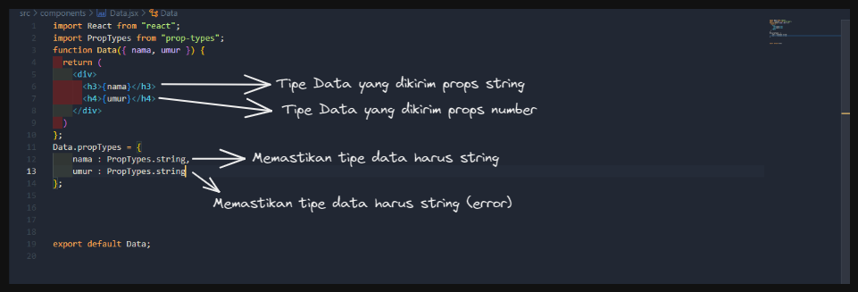
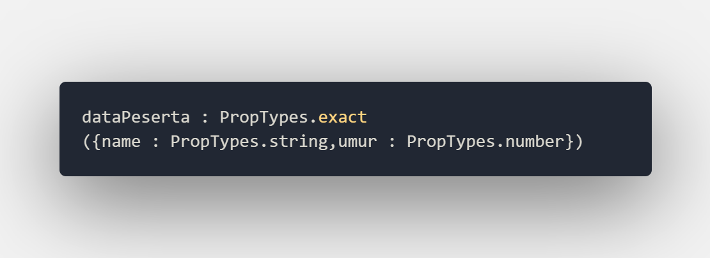
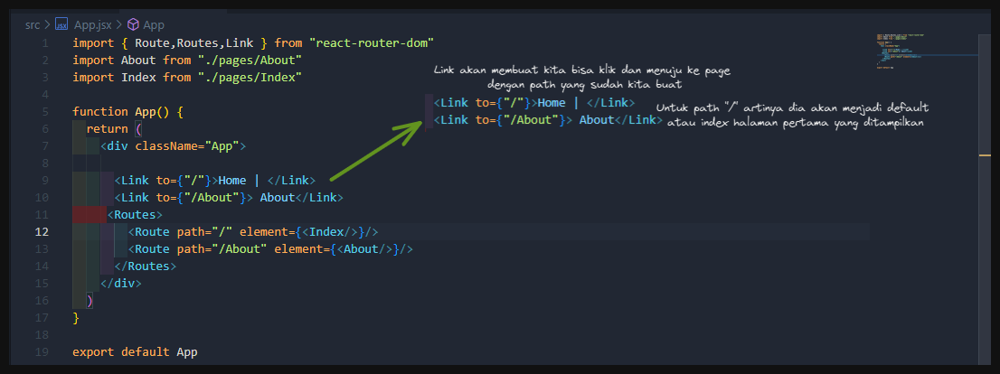
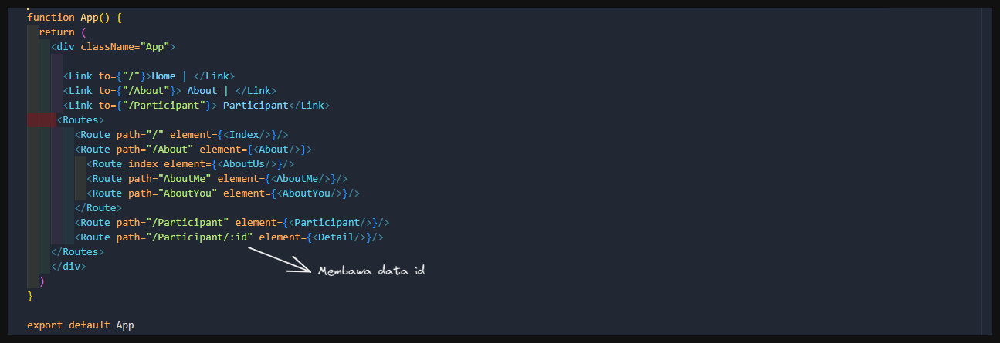
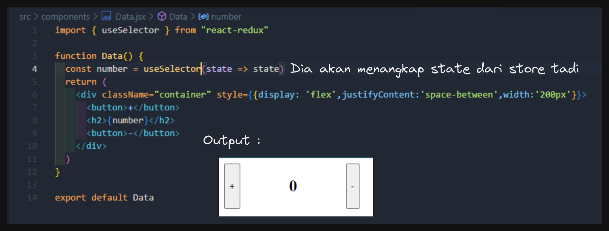

# MSIB SKILVUL #TECH4IMPACT BATCH 3

## Data diri  :rocket:
#### Nama : Daffa Radhitya PWP
#### EMAIL : 111202012648@mhs.dinus.ac.id
#### Univ. Asal : Universitas Dian Nuswantoro
#### Track : Frontend Web Developer
#### Group : FEBE 13 /FE 2
---

## Resume week 7
### React  JS (PropTypes)
- Setelah sebelumnya kita belajar cara mengirimkan atau membuat data yang kita miliki lebih dinamis dengan menggunakan props. Selanjutnya kita akan belajar tentang peanfaataan *proptypes* pada props
- Apasih itu proptypes ? pada saat kemarin kita belajar tentang props kita bisa mengirim data apapun dengan tipe data apapun. Ada suatu kondisi dimana kita ingin mengirimkan sebuah data dengan tipe data tertentu yang kita inginkan tentukan. 
- Disitu lah fungsi proptype. Jadi proptype merupakan library yang disediakan oleh react untuk melakukan typechecking atau simplenya digunakan untuk mengecek tipe data sebuah data yang kita miliki
- Sebelum kita menggunakan proptypes, kita perlu install library prop types dengan command `npm install --save prop-types` lalu jika sudah import proptype tersebut dari library seperti biasa
- Untuk bisa menggunakan proptype kita akan menggunakan sebuah syntax 

    `function.propTypes = {props:propTypes.tipeDataNya}`
- Selain itu kita juga bisa memastikan bahwa data yang kita kirim itu ada menggunakan `.isRequired`
- Kita coba langsung di codingan,

     
     

- Bisa terlihat jika ada yang tidak sesuai propTypesnya maka dia akan memunculkan sebuah error namun code tetap berjalan
- Selain cek tipe data string dan number kita juga bisa memilih salah satu atau lebih tipe data yang kita hedaki dengan syntax  `PropTypes.oneOfType([PropTypes.tipeData, PropTypes.tipeData])`
- Selain string dan number kita juga bisa memberi proptypes untuk arry dan object
- Untuk array kita menggunakan `ArrayOf()` kalo untuk object `shape({key:PrtotoTypes.tipeData})` agar lebih jelas kita coba di codingan :

     
- Bisa terlihat saya menggunakan sebuah *oneOfType* didalam array of, maksudnya adalah menentukan isian dari array bertipe data antara string atau number
- Pada proptypes object saya ada menggunakan sebuah `.isRequired` artinya props dengan key data peserta harus diisi dan tidak boleh kosong
- Nah untuk object sendiri tadi kita cuma mengecek valuenya harus sesuai tipe data yang kita tentukan, agar kita bisa memastikan juga bahwa kita mengisi key dengan sebuah value yang ada di object tersebut kita bisa menggunakan `exact` instead menggunakan `shape`, contoh

     
- Selain kita mengecek tipe data dari isi value dari key object, kita juga bisa memastikan bahwa value dari key object itu ada
---
### React  JS (React Router)
- Sebelumnya dari materi materi sebelumnya kita hanya bermain main pada satu page saja alias hanya berkutak di satu halaman dan menngunakan komponen untuk berinteraksi
- Namun sejatinya react juga bisa kita gunakan untuk berpindah halaman, yaitu kita memanfaatkan yang namanya *React Router*
- React router adalah sebuah library yang membantu kita untuk bisa melakukan pindah / link antar  satu halaman dengan halaman lain
- Meski begitu, pada react masih menggunakan konsep SPA (Single Page Application) sehingga kita berpindah akan tanpa refresh
- Ada tahap tahap pada kita ingin menggunakan react router, yang pertama kita akan buat folder baru di src kita namakan pages untuk menyimpan halaman, lalu :
    - install react router
                    
             npm install react-router-dom@6
    - Bungkus javascript react utama (main atau index jsx) dengan keyword `BrowserRouter`
            
            import ReactDOM from 'react-dom/client'
            import { BrowserRouter } from 'react-router-dom'
            import App from './App'

            ReactDOM.createRoot(document.getElementById('root')).render(
            <BrowserRouter>
                <App />
            </BrowserRouter>
            )
    - Selanjutnya react router kita sudah bisa digunakan, untuk menggunakannya pada komponen kita bisa menambahkan bebrapa import yaitu link,routes, dan route dari react-router-dom

            import { Route,Routes,Link } from "react-router-dom"

    - Selanjutnya kita akan membuat path kita memanfaatkan keyword routes dan route
            
        
- Untuk Router sendiri maksudnya adalah menetukan sebuah rute dengan path yang kita sudah tentukan untuk mencapai page tertentu, lalu routes adalah sebuah tampungan yang digunakan menyimpan sebuah sebuah route itu tadi, bagaimana dengan link ?
- Link sendiri kita manfaatkan untuk action yang kita lakukan saat berpindah halaman seperti tag `` pada html, agar lebih paham terkait link kita cek codingan di bawah :

    
    

- Nah jika kita andaikan `<Link></Link>` adalah sebuah tag anchor html, maka attribute `to` merupakan sebuah href layaknya tag anchor html. Maka dari itu memungkinkan kita untuk berpindah ke alamat itu yang mana pada react router berupa path   
- Nah selain itu kita juga bisa memberikan route dengan path `*` yang artinya halaman gak ada atau not found

        <Routes>
        ...
        <Route path="*" element={<NotFound />} />
        ...
        </Routes>

- Selanjutnya bagaimana jika kita memiliki sebuah route yang didalamnya terdapat child berupa route juga. Biasanya disebut dengan nested route
- Pada nested route, route yang memiliki child akan menjadi sebuah double tag yang didalamnya kita buat bungkus childnya. Contoh :

    

- Keyword `index` pada child menunjukkan bahwa halam child tersebut akan ditampilkan pertama
- `</Outlet>` berfungsi untuk mengambil semua informasi route yang sudah kita buat di awal
- Selanjutnya kita akan belajar cara mengirim sebuah data dari satu pages ke page lainnya. Simplenya kita akan membawa sebuah data yang nanti kita gunakan untuk memproses dengan data tersebut ke pages selanjutnya
- Terdapat sebuah perbedaan saat kita ingin mengirim sebuah data dengan router, pada path kita harus menuliskan id atau data apa yang digunkan sebagai data yang dibawa, contoh

        <Route path="/Participant/:id" element={<Detail/>}/>

- Disini maksudnya adalah kita menggunakan sebuah path dengan membawa data dan mengirim data tersebut ke page `<Detail/>`
- Pada konsep ini kita menggunakan hook `useNavigate()` untuk menavigasi sekaligus membawa sebuah data ke pages selanjutnya dan `useParams()` untuk mengambil data nya. Kita coba di codingan

    
    
    

- Pada codingan diatas terlihat bahwa nantinya di path kita bisa menambahkan sebuah data yang ingin kita bawa
- Yang tidak kalah penting kita juga perlu import useNavigate dan useParams agar bisa digunakan
- Pada trigger useNavigate saya menggunakan sebuah fungsi button onClick yang akan menjalankan useNavigate dengan membawa sebuah parameter id data yang di klik
- Pada detail, useParams akan menampilkan sebuah object. Maka dari itu kita perlu men-destructure agar bisa mendapat value tidak dalam object. Dan hasilnya akan nampak seperti dibawah :

    
---
### React JS Redux (Intro TO Redux)
- Sebelumnya kita sudah belajar banyak tentang cara menyimpan, mengirim data agar lebih dinamis baik dengan useState untuk local maupun props agar bisa kita kirimkan antar component. Namun jika kita mempunyai data yang essensial atau penting untuk kita gunakan di setiap komponen nantinya akan susah untuk di manage.

 

 - Nah illustrasi diatas merupakan gambaran tepat bagaiamana tampaknya jika kita terus mengoper sebuah data antar satu komponen dan ke komponen selanjutnya. Hal tersebut istilahnya disebut *Props Drilling*
 - Props drilling merupakan hal yang sangat dihindari khususnya saat kita ingin develop aplikasi kita. Simple saja apabila kita ingin merubah data akan sangat ribet dan susah.
 - Cara mengatasinya adalah kita buat suatu tempat penampung yang dimana kita dapat menyimpan data kita lalu kita ambil dari penampung tadi, otomatis semua component yang mengambil data disitu akan secara leluasa mendapat datanya baik mau diubah maupun ditambah atau diganti (dimanipulasi)
- Lalu apa yang bisa kita lakukan di react ini untuk bisa mengimplementasikan solusi tersebut ?. Kita bisa menggunakan atau memanfaatkan sebuah library yang mana akan sebagai tools bantu agar kita bisa membuat sebuah penampung tadi pada react. Library itu namanya *redux*
- Redux merupakan salah satu library berupa state management yang membantu kita membuat penampung untuk state atau data kita agar bisa diakses component kebawah.

- Diatas merupakan concept sederhana dimana nantinya aplikasi react kita akan mengambil data dari redux 
- Untuk bisa menggunakan redux kita perlu download dan install terlebih dahulu, caranya 

        npm install react react-redux

- Setelah kita install kita redux kita sudah miliki tinggal kita coba gunakan. Ada beberapa hal pada redux yang perlu kita pahami antara lain :
    - **Store** ; Store merupakan sebuah tempat yang kita buat pada redux untuk menyimpan keseluruhan data yang akan kita tampung. Nantinya kita bisa ibaratkan store seperti gudang.
    - **Reducer** ; Reducer merupakan sebuah tempat pada redux yang dimana proses sebuah state kita bisa oleh tergantung action apa yang kita lakukan
    - **Action** ; Action merupakan tempat dimana kita mendefinisikan sebuah action atau tindakan yang kita ingin lakukan. Nantinya kita akan kirim type action kita ke reducer untuk eksekusi
- Ada beberapa hal yang harus dilakukan sebelum bermain dengan redux. Pertama, buat folder redux di folder src. Kedua, buat folder action,reducer, dan store didalam folder redux.
- Setelah folder siap, kita buat sebuah action untuk menentukan kita mau apa terhadap state yang akan kita simpan di store

    
- Setelah action siap, selanjutnya kita pindah ke reducer untuk mengolah state apa yang kita punya dan mau kita apakan saja state itu.

    

- Pada reducer kita perlu membuat sebuah state apa atau data apa yang akan kita gunakan. Disini aku menggunakan data angka yang apabila action increment akan bertambah 1 dan decrement berkurang 1 (Counter). 
- Perlu diperhatikan juga bahwa function reducer harus memiliki 2. Satu untuk initial state atau state yang kita buat dan yang kedua untuk action yang kita sudah buat sebelumnya.
- Dengan switch case nantinya kita akan mengecek dari action apakah decrement atau increment berdasarkan type dari actionnya.
- Setelah itu kita buat gudangnya karena reducer bertindak sebagai raknya.
- Pada store kita hanya akan melakukan command createStore dan akan kita masukan reducer (atau rak kita tadi)

    
- Setelah semua sudah berarti tandanya kita sudah memiiki sebuah tempat penampunng yang menampung state kita. Selanjutnya kita akan memberi tanda atau memberi tahu untuk component lain bahwa kita menggunakan sebuah state management, lalu juga menangkap data dari redux dan mengirim action ke redux
- Nanti pada saat kita menampilkan sebuah data dari redux kita akan berkenalan lagi dengan hook baru lagi yaitu `useSelector`. Sedangkan untuk mengirim action ke redux kita akan berkenalan dengan `useDsipatch`. Sebelum itu mari kita beri tahu untuk component bahwa kita menggunakan state management
- Pada js utama react (biasanya Main.jsx atau Index.js) kita memberi tahu dengan membuat sebuah wrap dengan nama `<Provider></Provider>`. Provider berfungsi menghubungkan component yang ada pada react kita ke redux yang sudah kita buat

    

- Pada atribut di provider kita mennghubungkan component yang kita miliki dengan sebuah store yang sudah kita buat tadi
- Selanjutnya kita coba menampilkan angka yang ada pada store dengan useSelector

    

- Bisa terlihat di output bahwa number yang diterima state bawaan dari state yang ada pada store (initial_state). Apabila merubah maka dia akan ikut berubah 
- Selanjutnya kita buat untuk increment dan decrement angka dan ketika kita increment kita juga akan memanggil action increment tadi dengan menggunakan `useDispatch`. Idenya masih sama seperti dulu kita membuat event onclick pad abutton untuk menerima semua perintah

    
    
---
### React JS Redux (Combine Reducer dan Payload)
- Setelah kita paham sebelumnya menggunakan mengoperasikan sebuah redux selanjutnya kita akan belajar membuat redux dengan 2 reducer serta juga menggunakan sebuah data yang kita bawa untuk kita olah di redux.
- Untuk menggunakan 2 reducer atau lebihkita bisa menggunakan module yang diberikan oleh redux yaitu `combinedReducer`. Kita akan berikan itu di store kita. Satu redux atau project kita hanya bisa mempunyai satu gudang atau store

    
- Selanjutnya kita buat reducer ke 2, disini aku mau buat form yang bisa diisi nama dan akan append nama di store dan ditampilkan

    
- Ada action add data sebelum kita lihat codingan di component kita cek terlebih dahulu di action untuk yang baru

    
- Untuk codingan  diatas bisa telihat function action kita memiliki sebuah parameter dimana parameter ini nantinya akan berfungsi untuk membawa data nama berupa payload dan diproses di reducer2

    

- Karena kita gunakan combined reducer maka output statenya untuk useSelector akan menjadi object, maka sebab itu kita perlu dot notation untuk memilih ingin menggunakan reducer yang mana
Selanjutnya kita panggil dispatch seambil membawa parameter untuk diberi kedalam payload di action tadi. Maka hasilnya akan seperti di bawah 

    
---
### React JS Redux-Thunk
