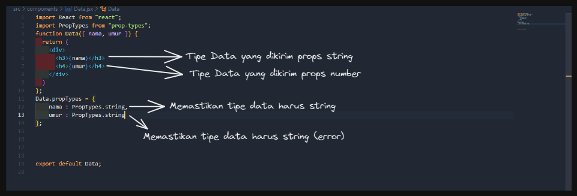
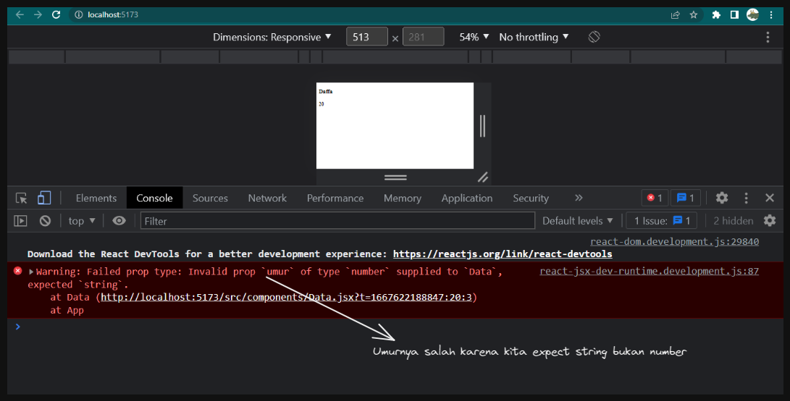
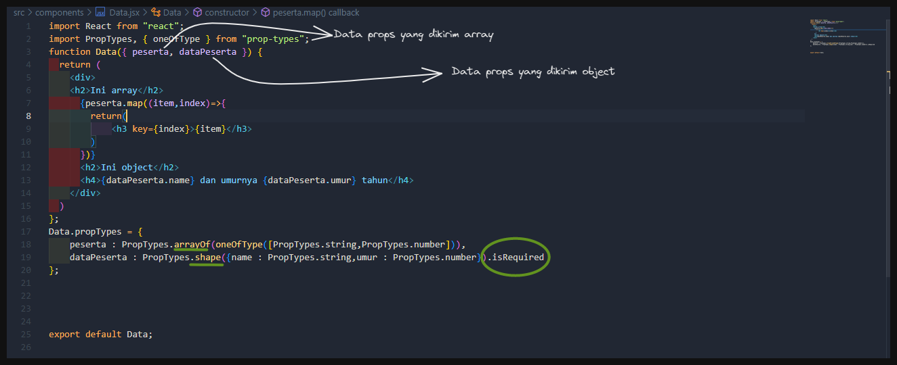
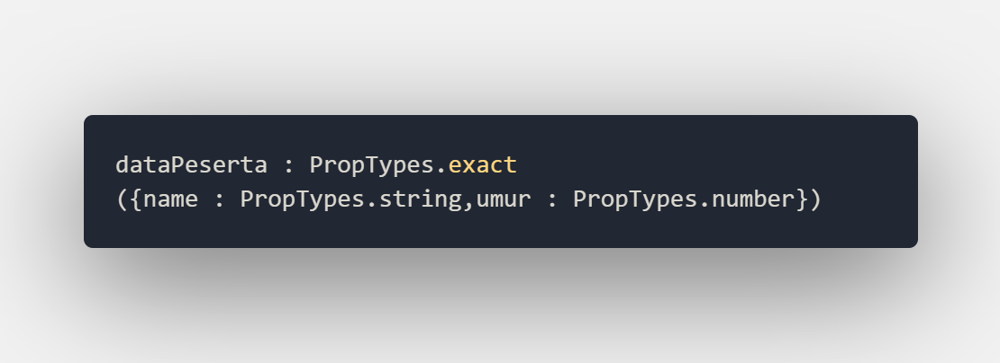
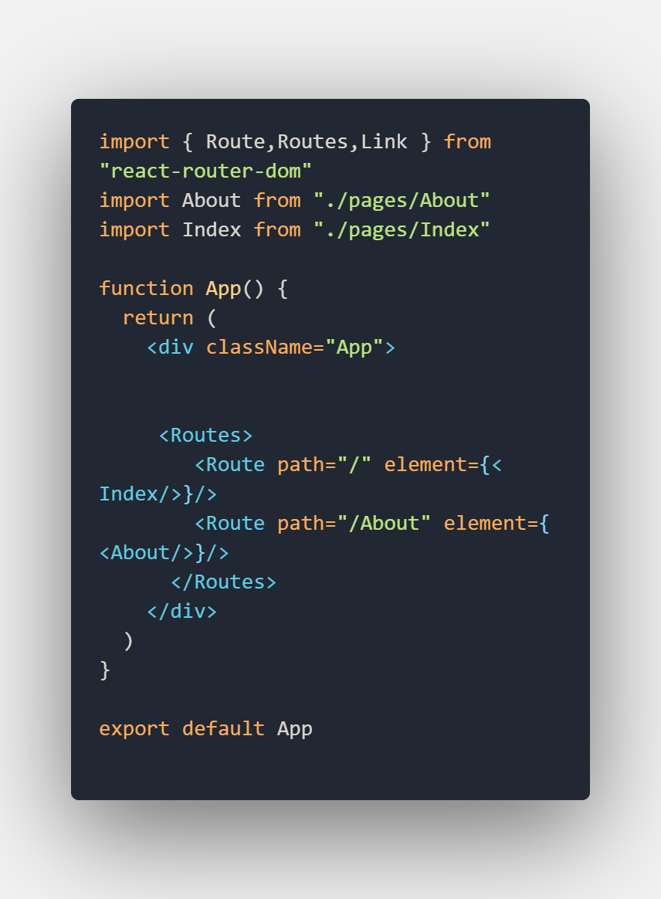
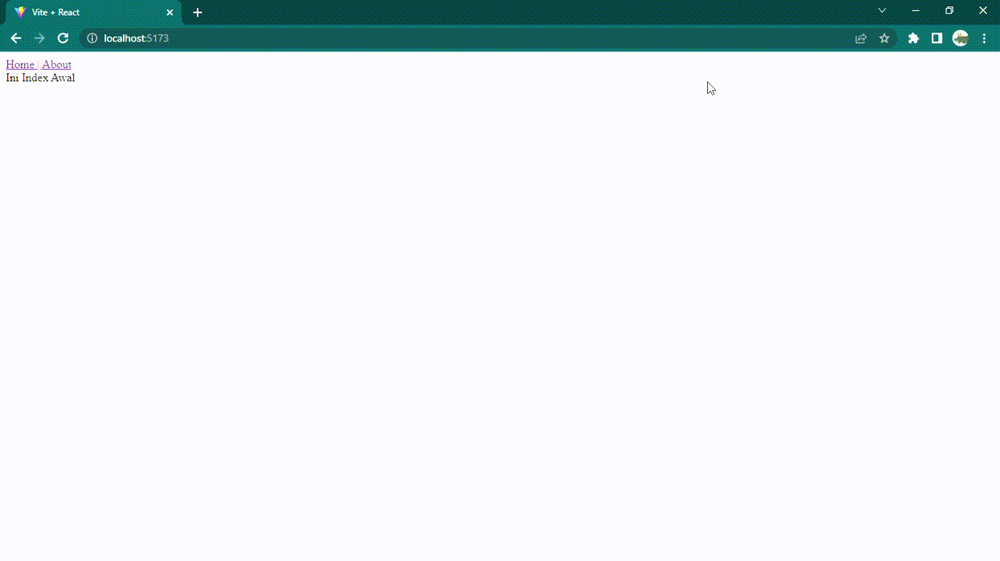

# MSIB SKILVUL #TECH4IMPACT BATCH 3

## Data diri  :rocket:
#### Nama : Daffa Radhitya PWP
#### EMAIL : 111202012648@mhs.dinus.ac.id
#### Univ. Asal : Universitas Dian Nuswantoro
#### Track : Frontend Web Developer
#### Group : FEBE 13 /FE 2
---

## Resume week 7
### React  JS (PropTypes)
- Setelah sebelumnya kita belajar cara mengirimkan atau membuat data yang kita miliki lebih dinamis dengan menggunakan props. Selanjutnya kita akan belajar tentang peanfaataan *proptypes* pada props
- Apasih itu proptypes ? pada saat kemarin kita belajar tentang props kita bisa mengirim data apapun dengan tipe data apapun. Ada suatu kondisi dimana kita ingin mengirimkan sebuah data dengan tipe data tertentu yang kita inginkan tentukan. 
- Disitu lah fungsi proptype. Jadi proptype merupakan library yang disediakan oleh react untuk melakukan typechecking atau simplenya digunakan untuk mengecek tipe data sebuah data yang kita miliki
- Sebelum kita menggunakan proptypes, kita perlu install library prop types dengan command `npm install --save prop-types` lalu jika sudah import proptype tersebut dari library seperti biasa
- Untuk bisa menggunakan proptype kita akan menggunakan sebuah syntax 

    `function.propTypes = {props:propTypes.tipeDataNya}`
- Selain itu kita juga bisa memastikan bahwa data yang kita kirim itu ada menggunakan `.isRequired`
- Kita coba langsung di codingan,

     
     

- Bisa terlihat jika ada yang tidak sesuai propTypesnya maka dia akan memunculkan sebuah error namun code tetap berjalan
- Selain cek tipe data string dan number kita juga bisa memilih salah satu atau lebih tipe data yang kita hedaki dengan syntax  `PropTypes.oneOfType([PropTypes.tipeData, PropTypes.tipeData])`
- Selain string dan number kita juga bisa memberi proptypes untuk arry dan object
- Untuk array kita menggunakan `ArrayOf()` kalo untuk object `shape({key:PrtotoTypes.tipeData})` agar lebih jelas kita coba di codingan :

     
- Bisa terlihat saya menggunakan sebuah *oneOfType* didalam array of, maksudnya adalah menentukan isian dari array bertipe data antara string atau number
- Pada proptypes object saya ada menggunakan sebuah `.isRequired` artinya props dengan key data peserta harus diisi dan tidak boleh kosong
- Nah untuk object sendiri tadi kita cuma mengecek valuenya harus sesuai tipe data yang kita tentukan, agar kita bisa memastikan juga bahwa kita mengisi key dengan sebuah value yang ada di object tersebut kita bisa menggunakan `exact` instead menggunakan `shape`, contoh

     
- Selain kita mengecek tipe data dari isi value dari key object, kita juga bisa memastikan bahwa value dari key object itu ada
---
### React  JS (React Router)
- Sebelumnya dari materi materi sebelumnya kita hanya bermain main pada satu page saja alias hanya berkutak di satu halaman dan menngunakan komponen untuk berinteraksi
- Namun sejatinya react juga bisa kita gunakan untuk berpindah halaman, yaitu kita memanfaatkan yang namanya *React Router*
- React router adalah sebuah library yang membantu kita untuk bisa melakukan pindah / link antar  satu halaman dengan halaman lain
- Meski begitu, pada react masih menggunakan konsep SPA (Single Page Application) sehingga kita berpindah akan tanpa refresh
- Ada tahap tahap pada kita ingin menggunakan react router, yang pertama kita akan buat folder baru di src kita namakan pages untuk menyimpan halaman, lalu :
    - install react router
                    
             npm install react-router-dom@6
    - Bungkus javascript react utama (main atau index jsx) dengan keyword `BrowserRouter`
            
            import ReactDOM from 'react-dom/client'
            import { BrowserRouter } from 'react-router-dom'
            import App from './App'

            ReactDOM.createRoot(document.getElementById('root')).render(
            <BrowserRouter>
                <App />
            </BrowserRouter>
            )
    - Selanjutnya react router kita sudah bisa digunakan, untuk menggunakannya pada komponen kita bisa menambahkan bebrapa import yaitu link,routes, dan route dari react-router-dom

            import { Route,Routes,Link } from "react-router-dom"

    - Selanjutnya kita akan membuat path kita memanfaatkan keyword routes dan route
            
        
- Untuk Router sendiri maksudnya adalah menetukan sebuah rute dengan path yang kita sudah tentukan untuk mencapai page tertentu, lalu routes adalah sebuah tampungan yang digunakan menyimpan sebuah sebuah route itu tadi, bagaimana dengan link ?
- Link sendiri kita manfaatkan untuk action yang kita lakukan saat berpindah halaman seperti tag `` pada html, agar lebih paham terkait link kita cek codingan di bawah :

    
    

- Nah jika kita andaikan `<Link></Link>` adalah sebuah tag anchor html, maka attribute `to` merupakan sebuah href layaknya tag anchor html. Maka dari itu memungkinkan kita untuk berpindah ke alamat itu yang mana pada react router berupa path   
- Nah selain itu kita juga bisa memberikan route dengan path `*` yang artinya halaman gak ada atau not found

        <Routes>
        ...
        <Route path="*" element={<NotFound />} />
        ...
        </Routes>