# MSIB SKILVUL #TECH4IMPACT BATCH 3

## Data diri  :rocket:
#### Nama : Daffa Radhitya PWP
#### EMAIL : 111202012648@mhs.dinus.ac.id
#### Univ. Asal : Universitas Dian Nuswantoro
#### Track : Frontend Web Developer
#### Group : FEBE 13 /FE 2
---

## Resume week 8
### React  JS (Context)
- Sebelumnya kita belajar tentang penggunaan redux sebagai state managemen system. Lalu sekarang kita akan mencoba penggunaan context sebagai library bawaan react untuk mengatur state kita.
- Simplenya pada context disini kita tidak terlalu rumit seperti redux. Context akan membuat sebuah state yang kita miliki sebagai state dengan scope global yang akan kita oper antar component.
- Kita tidak perlu menginstall karena context, yang perlu kita lakukan pertama adalah mebuat sebuah componen untuk menampung state kita.
- Didalam component tersebut kita buat sebuah context dan useState untuk menampung data. Serta membuat sebuah return beruba context dengan provider dan value yang sudah kita buat dengan useState tadi.
    
    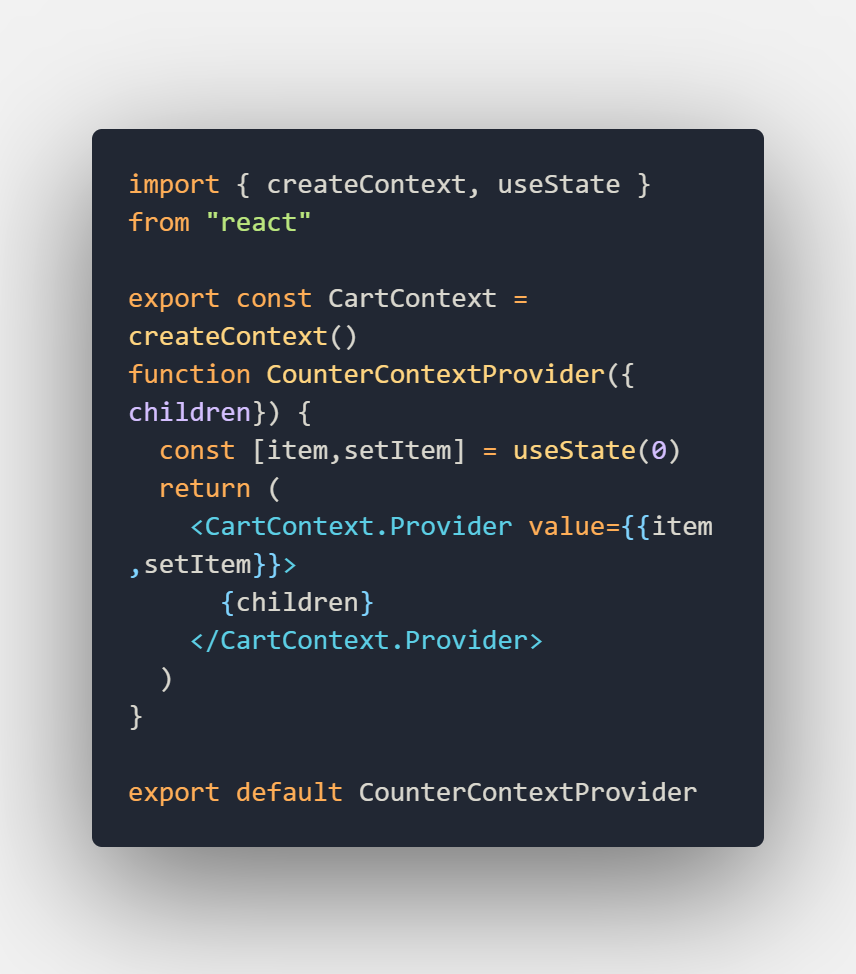 

- Setelah itu kita wrap app di main.jsx dengan context kita dengan context component yang sudah kita buat sebelumya.

    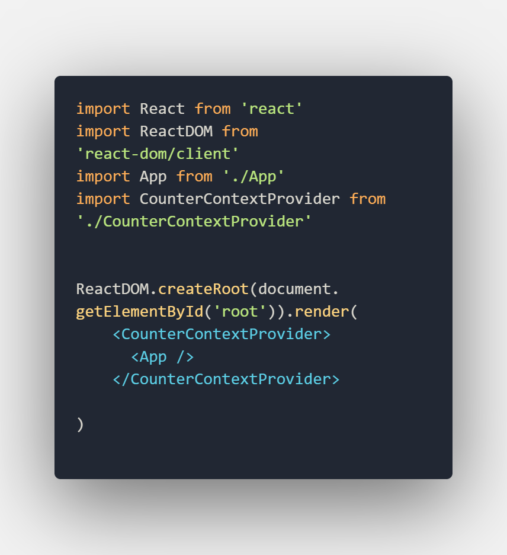 
- Hal yang perlu diperhatikan dari hal diatas adalah ketika kita wrapsebuah component, data yang kita bisa ambil itu dari atas kebawah, tidak bisa dari bawah keatas. Dengan contoh diatas kita tidak bisa mengambil data dari component App untuk CounterProvider. Tapi hanya bisa sebaliknya.
- Yang kita perlu lakukan adalah selalu melakukan wrap kedalam component yang datanya global yang ingin component di bawahnya mengakses. Semakin banyak dan semakin seperti itu. Konsep tersebut dinamakan **context hell**
- Setelah itu mari kita ambil data dari state global ke counter. DI component counter dia akan mengambil data, menampilkan sekaligus mengolah state global tadi. Maka dari itu tiap button di component counter dia akan memproses state *item* tadi

    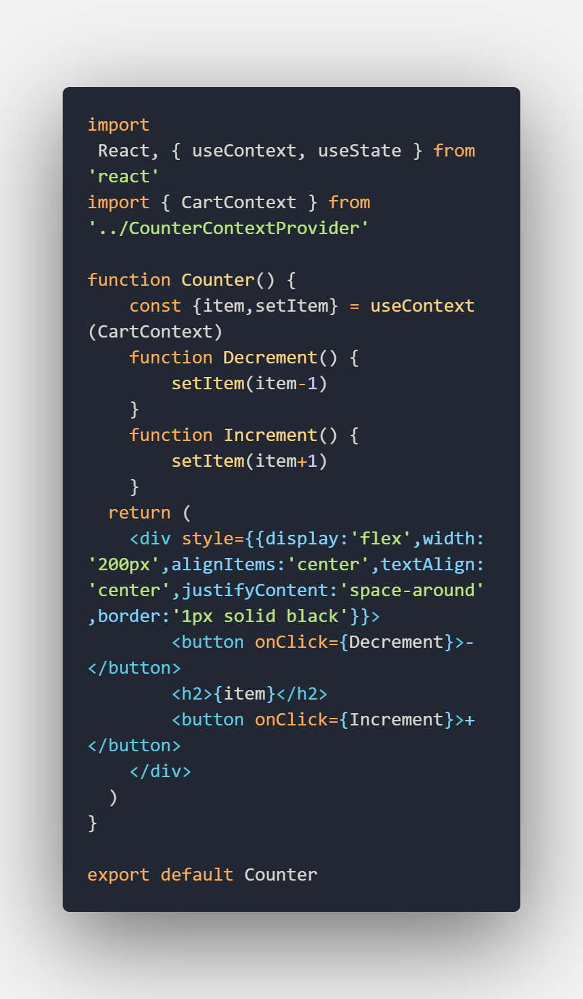 
- Untuk mengambil state global kita tadi, kita menggunakan yang namanya `useContext` dan ambil datanya dari component context.
- Setelah dapat datanya kita bisa mainkan seperti bermain useState biasa. 

    
- Alasan saya menggunakan object untuk mengririm state dari component context ke component lain agar lebih mudah saat melakukan proses.
- Tidak hanya satu komponen, komponen lain juga bisa menerima data yang ada di global, contoh saya akan gunakan data global ditampilkan di component keranjang

    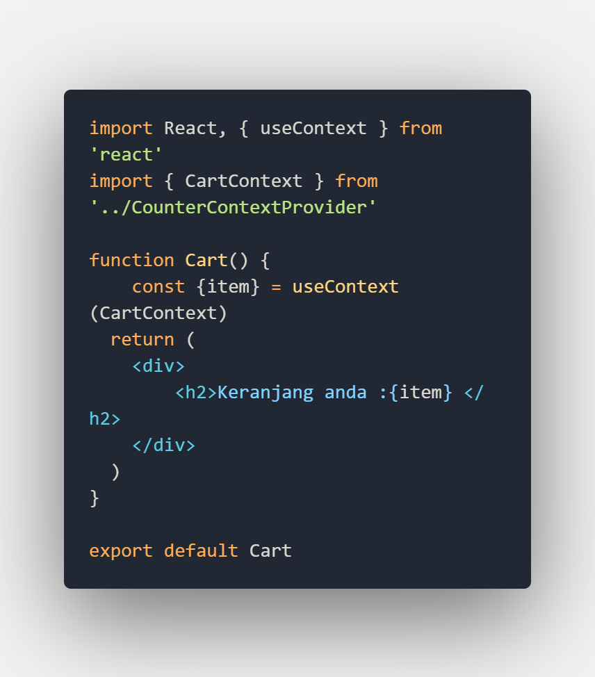
    
---
### React  JS Context (useReducer)
- Setelah kita mengetahui bagaiman konsep dan kenapa kita bisa menggunakan context, selanjutnya muncul pertanyaan. Bagaiamana jika kita ingin membuat aplikasi kita lebih complex ? apakah masih bisa menggunakan context, apa tidak sebagiknya menggunakan redux ?
- kita bisa menggunakan context dengan menerapkan konsep yang sebelumnya kita pelajari, kita akan menggunakan reducer, mengubah nilai dari `init_variable` dan nantinya kita juga akan menggabungkan antara context dan konsep redux
- yang pertama pada component context kita buat sebuah initial_variable. 

    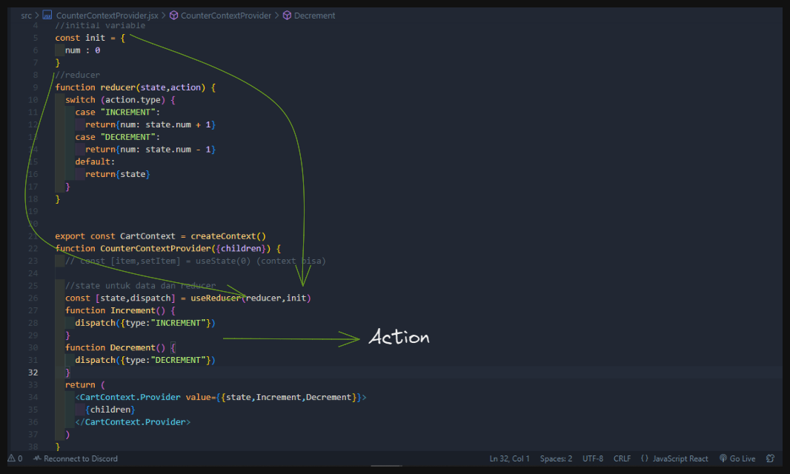
- Kita nantinya akan membawa state (sebagai nilai yang da di initial state), Increment dan Decrement(sebagai action yang sudah kita dispacth)
- Setelah itu kita gunakan metode context dengan `useContext` untuk mendapatkan 3 data tadi.

    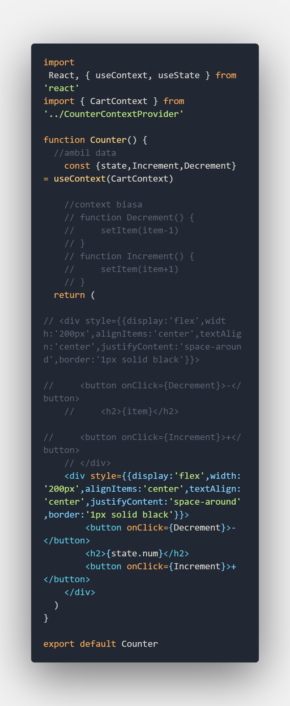
- Selanjutnya kita juga lakukan yang sama untuk component cart, dan hasilnya seperti ini

    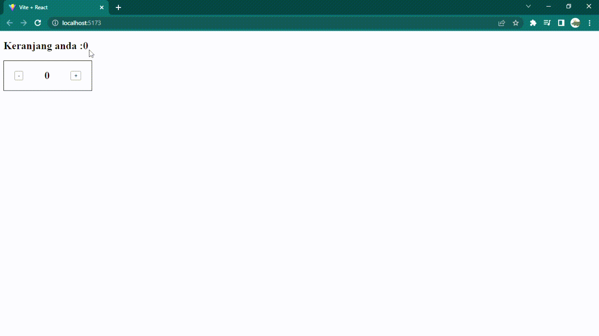   
---
### React  JS (Intro To Testing)
- Kita sudah tidak asing lagi dengan kata yang *testing*. Testing sendiri biasanya kita gunakan untuk mencoba / menguji aplikasi kita apakah sudah sesuai ekspektasi kita sebagai developer maupun sebagai user.
- Walaupun tidak sering kita melakukan testing, secara tidak sadar kita selalu melaukan testing seperti saat mengetes apakah program kita jalan apakah sesuai flow, dan arsitekturnya.
- Untuk testing sendiri dibagi menjadi beberapa kategori, ada yang **automated** dan **manual** testing.
    - **Manual** testing biasanya seperti menguji setiap ekspektasi dan percobaan secara manual tanpa bantuan code atau sistem
    - **Automated** testing kebalikan manual testing yang dimana pada testing ini kita akan menggunakan code untuk membantu bagaimana cara kita tahu apakah prgram kita sudah sesuai ekspektasi kita
- Pada kali ini kita akan fokus ke bagian automated testing. Pada automated testing terdiri dari beberapa macam, e2e (end to end), integrasi, dan unit.
    - Unit; Biasanya tipe testing yang mana kita melakukan pengujian satu persatu code kita tanpa terkecuali untuk menguji ekspektasi dari program kita
    - Intergrasi; Biasanya digunakan untuk mengetes apakah aplikasi kita connect atau terhubung dengan sistem lain,contohnya database.
    - E2E, Biasanya digunakan untuk mengetes sesuai *behaviour* kita sebagai user. Ekspektasi user akan diuji sesuai pengalaman user menggunakan aplikasi kita
- Pada testing juga ada phase phase nya seperti test fails (ketika masih gagal dan belum berhasil), test suscesful(test berhasil), refactoring(upgrade program kita)
- Untuk testing kali ini kita akan belajar di bagian unit testing, untuk tools untuk testing sangat banyak antara lain, Jest, Cypress, dan untuk react seperti RTL (react test library).
---
### React  JS Testing (Jest dan RTL)
- Salah satu tools untuk kita dapat melakukan testing yaitu menggunakan jest. Jest akan membantu kita untuk tahu apakah codingan kita sudah sesuai dengan ekspektasi yang mana kita buat juga.
- Langkah pertama adalah kita perlu install jest terlebih dahulu
        
        npm install --save-dev jest
- Setelah itu kita buat file untuk javascript biasa dan testing dengan nama `[nama-folder].test.js`
- Setelah siap kita akan mulai menulis sebuah eskpektasi untuk testing. Disini aku akan menggunakan sebuah fungsi untuk menentukan genap ganjil. Syntaxt menulisnya

        test('desc ekspektasi', () => { "ekspektasi" })
- Hasilnya seperti ini

    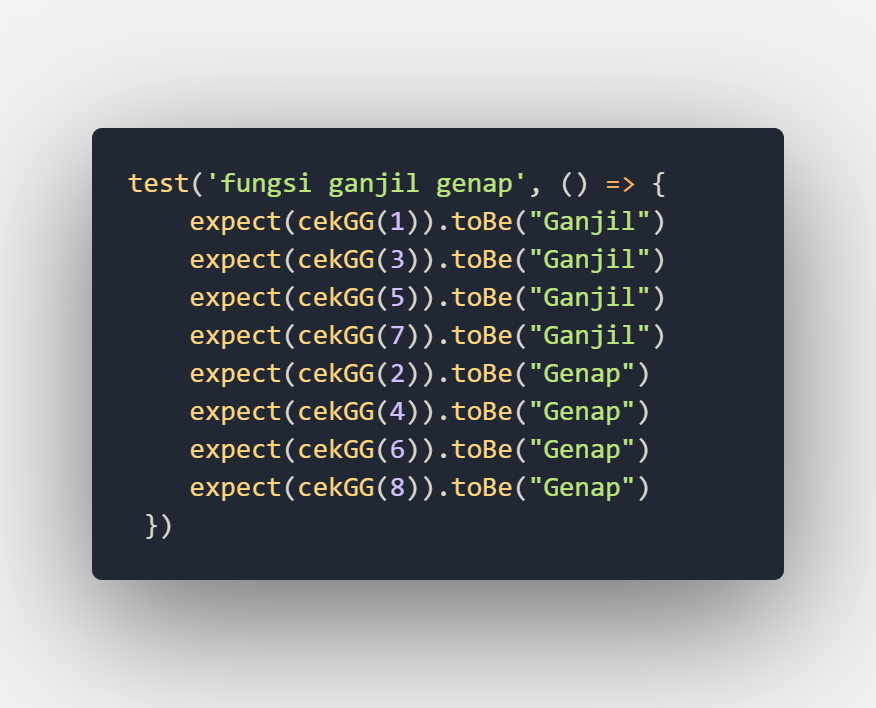
- Keyword ToBe merupakan hasil ekspektasi yang kita harapkan 
- Setelah buat ekspektasi itu, kita coba untuk membuat fungsi.
    
    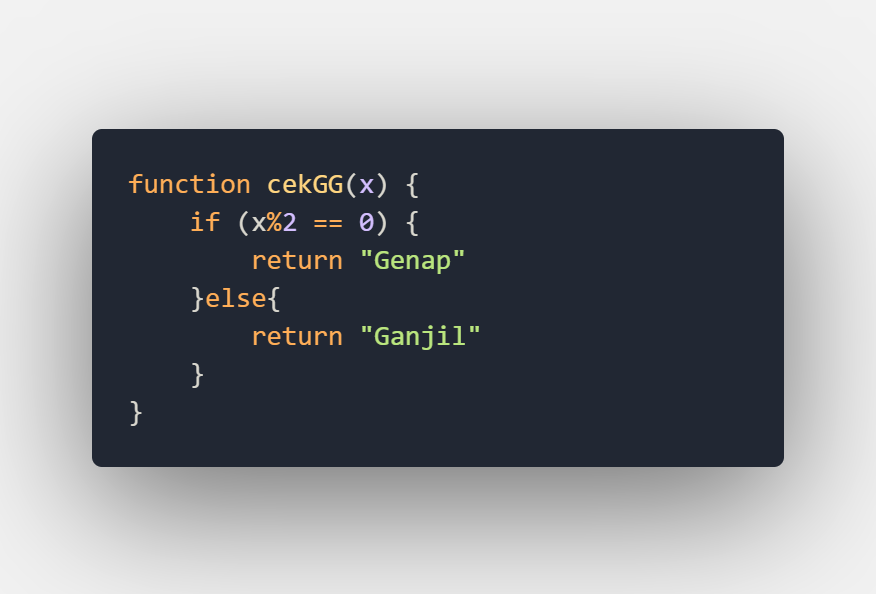
- Setelah semua siap kita import fungsi diatas ke file testing tadi dan kita jalankan testing dengan keyword

        $npm run test
    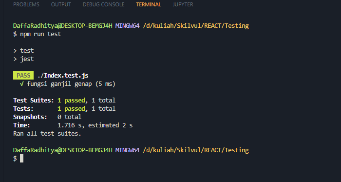
- Nah tadi itu merupakan sebuah testing menggunakan jest. Intinya adalah ketika kita menulis ekspektasi dan menulsi fungsi hingga sebelum dijalankan testing maka dia masi masuk kedalam phase ***Red Phase*** test fails, kalo sudah berhasil semua dia masuk ***Green Phase*** atau test berhasil, dan ketika memperindah nanti kita akan masuk ***Blue Phase*** refactoring.
- lalu bagaimana jika kita ingin testing dengan react. kita bisa gunakan react testing library (RTL) setelah ini
- Untuk react kita juga bisa melakukan testing. Dimana testing pada react menggunakan library.
- Pada saat kita create react menggunakan npx maka sudah otomatis ada test.js
- React Testing Library ini dibuat di atas DOM Testing Library dengan menambahkan API untuk bekerja dengan komponen React sehingga didalam RTL ini nnanti kita dapat memgetahui render suatu komponen yang ada. Contoh 
- Disini saya akan membuat sebuah react app dengan component nama dan sebuah button di app. Nantinya testing akan mengecek untuk button dan component nama

    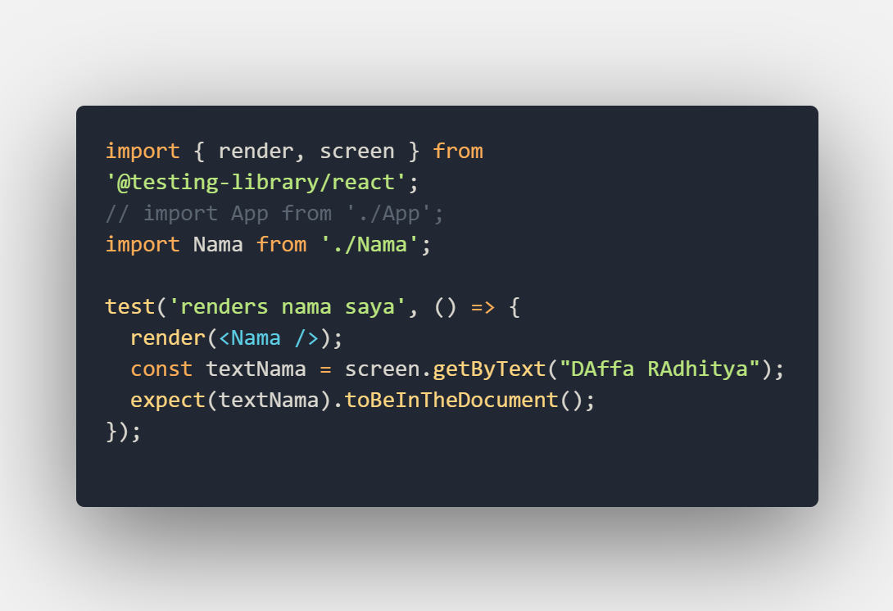
    untuk testing komponen nama
    
    
    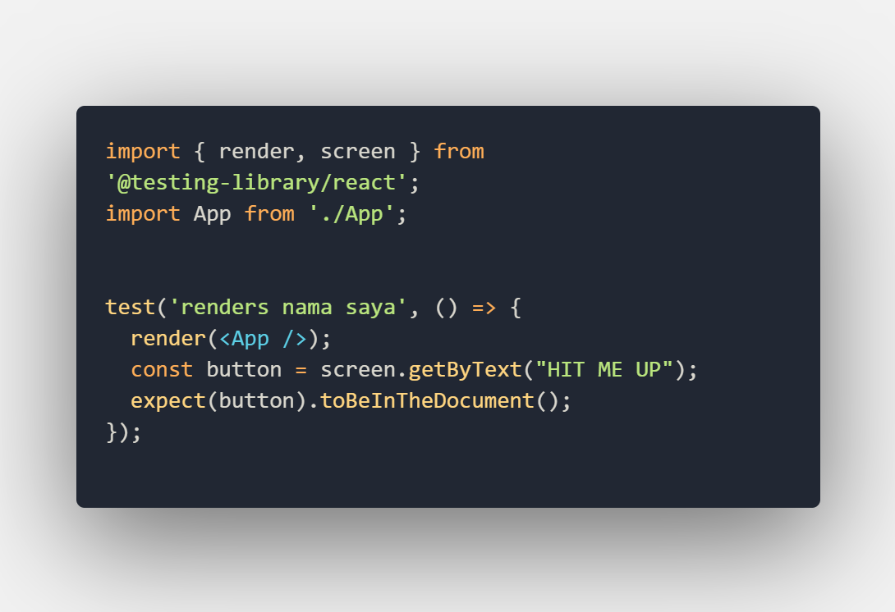
    untuk testing komponen button
- Bisa terlihat masih sama menggunakan test untuk memulai menulis expectation. Lalu ada render untuk merender component yang kita ingin. Setlajh itu kita ambil element elemenya dengan `screen...` lalu kita gunakan query getByText untuk mencari tulisan yang ada seusai yang kita ingin. 
- Kita bisa menggunakan banyak query lainnya seperti (getBy,findBy,queryBy,dll)
- Setelah itu kita expect bahwa yang kita ambil itu ada di document dengan query `toBeInTheDocoment` dan hasilnya

    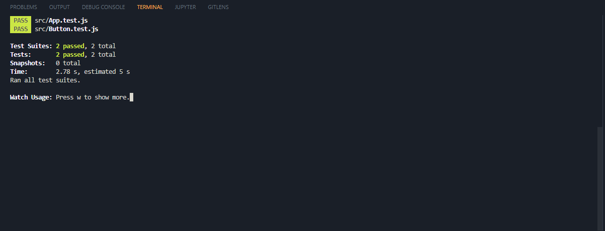